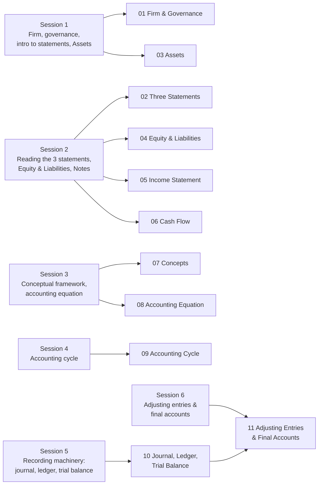

---
tags:
  - fra
  - moc
  - course-map
course: Financial Reporting & Analysis
dg-publish: false
dg-home: false
---

# 00 · FRA Course Map

> [!important] How to use this folder
> This is the **map of the whole exam-prep resource**. Material is organised **by topic** (following the syllabus sequence), *not* by session date. Each topic note merges the lecture notes + key takeaways + the relevant case discussion, and teaches the concept from scratch. The exam-prep layer ([[90-Master-Formula-Sheet]], [[91-Exam-Question-Bank]], [[92-Past-Paper-Breakdown]]) sits on top.

## Topic notes (syllabus order)

| #   | Topic note                                         | Teaches                                                                                                                                                                 | Syllabus session |
| --- | -------------------------------------------------- | ----------------------------------------------------------------------------------------------------------------------------------------------------------------------- | ---------------- |
| 01  | [[01-Firm-Governance-and-Reporting-Environment]]   | Why accounting exists; principal–agent problem; board, auditors, institutional framework; the annual report                                                             | S1 (Part A)      |
| 02  | [[02-The-Annual-Report-and-Three-Statements]]      | The three statements at a glance, how they link, standalone vs consolidated, notes to accounts                                                                          | S2               |
| 03  | [[03-Balance-Sheet-Assets]]                        | Assets: current vs non-current, PPE, goodwill, intangibles, equity-method investments, receivables, cash equivalents                                                    | S1 / S5          |
| 04  | [[04-Balance-Sheet-Equity-and-Liabilities]]        | Equity (share capital, other equity, book vs market value, NCI), liabilities, provisions, contingent liabilities, claim hierarchy                                       | S2 / S3          |
| 05  | [[05-Income-Statement-PandL]]                      | Revenue, expenses by nature, depreciation/amortisation/depletion, changes-in-inventory, exceptional items, EPS (basic & diluted)                                        | S2 / S3          |
| 06  | [[06-Cash-Flow-Statement]]                         | The three activities, indirect method, why profit ≠ cash                                                                                                                | S2               |
| 07  | [[07-Conceptual-Framework-and-Core-Concepts]]      | Separate entity, dual aspect, matching, historical cost, materiality, accrual, prudence, going concern, revenue recognition                                             | S3               |
| 08  | [[08-The-Accounting-Equation]]                     | Basic & expanded equation; revenue/expense as equity components; transaction-effect analysis                                                                            | S3 / S4          |
| 09  | [[09-The-Accounting-Cycle-Recording-Transactions]] | Double-entry, debit/credit rules, journal → ledger → trial balance → adjusting entries → statements                                                                     | S4               |
| 10  | [[10-Journal-Ledger-and-Trial-Balance]]            | Recording machinery in practice: journalising, ledger/T-accounts, balance c/d & b/d, trial balance; worked ten-transaction trading business                             | S5               |
| 11  | [[11-Adjusting-Entries-and-Final-Accounts]]        | Period-end adjustments → final accounts; closing entries; accumulated depreciation; perpetual vs periodic inventory; capital vs revenue expenditure; Leisure Centre Ltd | S6               |
| 12  | [[12-Adjusting-Entries-Practice-Narayanaswamy]]    | Full worked solutions — Narayanaswamy 4.14 (Admark), 4.15 (Navin Packaging), 4.16 (Mathew Adwaves, two periods)                                                         | S6 (practice)    |

## Exam-prep layer

- [[90-Master-Formula-Sheet]] — every formula in one place, each variable defined
- [[91-Exam-Question-Bank]] — computational + conceptual practice per topic, with worked solutions
- [[92-Past-Paper-Breakdown]] — Quiz 1 question-by-question, mapped to topic notes + patterns

## Running cases (applied examples)

| Case | Lives under | Teaches |
|---|---|---|
| **HUL FY26** (consolidated statements) | [[03-Balance-Sheet-Assets]], [[04-Balance-Sheet-Equity-and-Liabilities]], [[05-Income-Statement-PandL]], [[06-Cash-Flow-Statement]] | How real statements read; intangible-heavy FMCG; profit ≠ cash |
| **Music Mart** | [[08-The-Accounting-Equation]] | Transaction-effect analysis; "no-effect" events; historical cost |
| **John Fruit** | [[08-The-Accounting-Equation]] | Building a balance sheet from first transactions |
| **Maria Hernandez** | [[08-The-Accounting-Equation]], [[09-The-Accounting-Cycle-Recording-Transactions]] | Splitting the expanded equation into P&L + BS; implicit transactions |
| **Lone Pine Cafe (A & B)** | [[09-The-Accounting-Cycle-Recording-Transactions]] | Preparing a BS and income statement from raw facts | 
| **Ten-transaction trading business** | [[10-Journal-Ledger-and-Trial-Balance]] | Journal → ledger → trial balance drilled end-to-end; closing stock as an inventory balance |
| **Leisure Centre Ltd (Problem 4.12)** | [[11-Adjusting-Entries-and-Final-Accounts]] | Seven period-end adjustments → adjusted final accounts; part-year depreciation; dividends ≠ expense |
| **Narayanaswamy 4.14 / 4.15 / 4.16** | [[12-Adjusting-Entries-Practice-Narayanaswamy]] | Complete accounting cycle for service firms; accumulated depreciation; closing entries; two-period carry-forward |

## Syllabus → topic cross-reference

## The four thrusts of the course (keep these in mind)

Every topic serves one of the course's four aims. When revising, ask *which thrust* a concept belongs to:

1. **Overview** of financial statements — contents and structure → topics 02–06
2. **Logical framework** of how statements are prepared → topics 07–09
3. **Managerial discretion** — estimates, policies, choices (e.g. depreciation method, provisions, revenue recognition) → flagged throughout; a post-midterm focus
4. **Analysis** of financial statements — ratios, interpretation → introduced via the HUL reading notes; a later focus

> [!note] Scope note
> Topic notes now run through **Session 6** (adjusting entries & final accounts). Sessions 5–6 added the hands-on recording machinery ([[10-Journal-Ledger-and-Trial-Balance]]) and period-end adjustments ([[11-Adjusting-Entries-and-Final-Accounts]]). Some material (EPS diluted, convertible debentures, the full cash flow statement) reaches slightly beyond this — it is included where it appeared in your notes and is fair game once covered. The **Trading Account and Indian final-accounts illustrations** (returns, GST, provisions for doubtful debts, deferred revenue expenditure) are **Session 7** and not yet written up.

> [!warning] Corrections folded in from your own notes
> While merging, three factual slips in `Financial_Accounting_Notes_Complete` were corrected in the topic notes. Each is flagged with a `> [!warning]` at the point it matters:
> - Claim hierarchy — lenders rank **ahead of** preference shareholders, not behind → [[04-Balance-Sheet-Equity-and-Liabilities#Providers of capital — the claim hierarchy]]
> - Preference shareholders are **hybrid owners**, shown under equity → same note
> - Goodwill = purchase price − fair value of net assets acquired (**not** a resale spread) → [[03-Balance-Sheet-Assets#Goodwill]]
