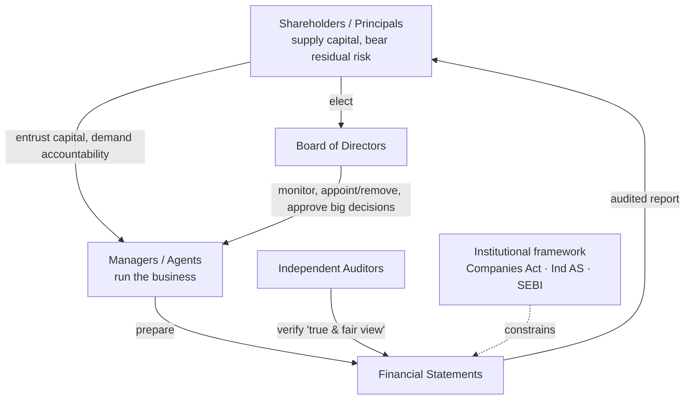

---
tags:
  - fra
  - topic
  - governance
  - session-1
course: Financial Reporting & Analysis
syllabus: Session 1 (Part A)
dg-publish: false
---

# 01 · The Firm, Governance & the Reporting Environment

> [!info] What this note covers
> Why financial accounting exists at all · the principal–agent problem · the mechanisms that manage it (board, auditors, reporting, regulation) · the four managerial decisions · the structure of the annual report. This is the *"why"* that everything else rests on.

---

## 1. Why does financial accounting exist?

Start with the problem it solves. In a modern company, the people who **own** the business are not the people who **run** it.

- **Owners (shareholders)** put up the capital but usually cannot run day-to-day operations — there may be millions of them, spread across the world.
- **Managers** run the firm on the owners' behalf, but they don't (mostly) own it.

This split — **separation of ownership from control** — is efficient (specialists run the firm; savers supply capital) but it creates a trust gap. The owners need a reliable, standardised, *verified* account of what the managers did with their money. **That account is the set of financial statements.** Financial accounting is the information system that lets absent owners monitor present managers.

> [!tip] One-sentence rationale
> Financial reporting exists because of the **principal–agent problem**: audited statements are the channel through which managers (agents) account to owners (principals) for the resources entrusted to them. This is called the **stewardship** or **accountability** role of accounting.

---

## 2. The principal–agent problem (the agency problem)

| Party         | Who                   | Role                                      | Interest                                                                       |
| ------------- | --------------------- | ----------------------------------------- | ------------------------------------------------------------------------------ |
| **Principal** | Shareholders (owners) | Provide capital, bear the *residual* risk | Maximise the value of their investment                                         |
| **Agent**     | Managers (executives) | Run operations on the principal's behalf  | *May* pursue their own interest — pay, power, perks, prestige, empire-building |

The tension: the agent's interests are **not automatically aligned** with the principal's. A manager might:

- build a bigger empire than is profitable (status, larger pay),
- take excessive perks,
- chase short-term results that flatter their bonus but hurt long-term value,
- or simply be lazy.

And here is the sting: **the shareholders cannot observe the managers directly.** They rely on **reports prepared by the very people they are trying to monitor.** A manager both *performs* and *reports on their own performance*. Left unchecked, that is an obvious conflict of interest — hence the elaborate machinery below.

---

## 3. The mechanisms that manage the conflict

Four overlapping mechanisms keep the agent honest:

| Mechanism                   | What it does                                                                                                                                                                                                                          |
| --------------------------- | ------------------------------------------------------------------------------------------------------------------------------------------------------------------------------------------------------------------------------------- |
| **Board of Directors**      | Elected by shareholders; oversees and monitors management, approves major decisions, appoints/removes and pays top executives. The board is the shareholders' standing representative between annual meetings.                        |
| **Auditors**                | An **independent** third party who examines the statements and gives an opinion on whether they show a *true and fair view*. The auditor's independence is what makes management's numbers credible to outsiders.                     |
| **Financial reporting**     | The formal, periodic channel through which managers account to owners. Standardised so it can be compared across firms and years.                                                                                                     |
| **Institutional framework** | The rulebook that constrains *how* reports are prepared: the **Companies Act**, **accounting standards (Ind AS)**, and **SEBI** regulations for listed firms. Without common rules, "profit" would mean whatever each manager wanted. |

> [!note] Why audit ≠ guarantee of no fraud
> The auditor expresses an *opinion* that the statements are free of **material** misstatement and give a *true and fair view*. It is reasonable assurance, not certainty, and it addresses fair presentation — not a promise the business will succeed.

### The three players in a nutshell

- **Shareholders** — owners; bear residual risk; elect the board; the ultimate audience of the report.
- **Board of Directors** — shareholders' watchdog over management.
- **Auditors** — independent verifiers who lend credibility to management's numbers.

---

## 4. The four managerial (financial) decisions

Financial statements are not produced for their own sake — they feed **decisions**. Every manager repeatedly makes four financial decisions, and each needs reliable financial information. These four also preview the sister finance courses.

1. **Investment / Capital Allocation decision** *(a.k.a. capital budgeting)* — which long-term, capital-heavy projects and assets to commit funds to.
2. **Financing decision** — what **mix of debt vs equity** funds the business.
3. **Dividend decision** — how much profit to **distribute vs retain**.
4. **Working Capital Management** — managing short-term assets and liabilities (inventory, receivables, payables, cash) so the business runs day to day.

> [!tip] Connect it forward
> These four map onto the **[[06-Cash-Flow-Statement|cash flow statement]]'s** three sections: financing & dividend decisions → *financing activities*; investment decisions → *investing activities*; working-capital management → *operating activities*. The statement is, in effect, a scorecard of these decisions.

---

## 5. Where this course is going — the four thrusts

The whole course is built around four aims (keep them straight — they recur):

1. **Overview** of financial statements — their contents and structure.
2. **Logical framework** — the accounting process behind how statements are prepared.
3. **Managerial choices** — the discretion, estimates and policies management applies (e.g. depreciation method, provisions).
4. **Analysis** — ratios and interpretation of statements.

See the full map in [[00-Course-Map#The four thrusts of the course (keep these in mind)]].

---

## 6. The Annual Report — structure and contents

The **annual report** is the full package a listed firm publishes each year. The audited financial statements are only *part* of it; much of it is narrative. Exam questions on Session 1 often test whether you know **what each section is for**.

| Section | What it is | Audited? |
|---|---|---|
| **Directors' Report** | The board's account of the year: performance, dividends recommended, changes in business, risks, compliance | No (statutory but not audited) |
| **Management Discussion & Analysis (MD&A)** | Management's narrative on results, industry conditions, opportunities, threats, outlook — the "story behind the numbers" | No |
| **Auditor's Report** | The independent auditor's opinion on whether the statements give a true and fair view; flags key audit matters | It *is* the audit |
| **The three financial statements** | [[03-Balance-Sheet-Assets\|Balance Sheet]], [[05-Income-Statement-PandL\|P&L]], [[06-Cash-Flow-Statement\|Cash Flow]] — the quantitative core | **Yes** |
| **Notes to the Financial Statements** | Accounting policies + detailed breakdowns of every line; often longer than the statements themselves | Yes |
| **Segmental reporting** | Results split by business segment / geography, so a diversified group isn't a black box | Yes |
| **Corporate Governance Report** | Board composition, committees, independence, remuneration — how the governance machinery of §3 actually operates | Partly |

> [!note] Narrative vs audited numbers
> A useful mental split: the **narrative sections** (Directors' Report, MD&A) are *management's voice* and are **not audited** — read them critically. The **financial statements + notes** are the *audited* core. When they seem to disagree, weight the audited numbers.

> [!example] Reading task from your notes
> The assigned exercise was to skim a real annual report's **Directors' Report and MD&A** and get a feel for what they convey — deliberately, the *unaudited narrative*, to see how management frames a year. Pair this with the HUL statements in topics 03–06 to see the audited side.

---

## 7. Forms of business (context for liability & reporting)

Different legal forms carry different **liability** and **reporting** obligations. This sets up the [[04-Balance-Sheet-Equity-and-Liabilities#Liability vs limited liability|limited-liability]] idea.

| Form | Liability | Separate legal entity? |
|---|---|---|
| Sole proprietorship | **Unlimited** | No |
| Partnership | **Unlimited** (shared) | No |
| One-person company | Limited | Yes |
| Private Ltd company | Limited | Yes |
| Public Ltd company | Limited | Yes |
| **LLP** (introduced 2009) | **Limited** | Yes |

> [!tip] The thread to the next topics
> The move from *unlimited* to *limited* liability, and from *proprietor* to *shareholder*, is exactly why the **[[07-Conceptual-Framework-and-Core-Concepts#Separate Entity (Business Entity) Concept|separate entity concept]] **exists: once the business is a distinct legal person, its accounts must be kept from *its* point of view, not the owner's.

---

## 8. Standalone vs consolidated (first look)

Because groups own other companies, statements come in two flavours:

- **Standalone** — the parent company's own legal entity only. Subsidiaries appear merely as a single line, "Investment in Subsidiary."
- **Consolidated** — the parent **and all its subsidiaries** presented as **one economic entity** — the complete financial picture of the group (e.g. HUL, Airtel, Tata). Line items are added together; two items appear that *never* exist standalone: **goodwill** and **[[04-Balance-Sheet-Equity-and-Liabilities#6. Non-Controlling Interest (NCI)|non-controlling interest (NCI)]]**.

Full treatment in [[02-The-Annual-Report-and-Three-Statements#5. Standalone vs Consolidated]]

---

## Key takeaways

- Accounting exists to solve the **principal–agent problem** — audited statements let owners monitor managers (the **stewardship** role).
- **Board, auditors, reporting, and the institutional framework (Companies Act / Ind AS / SEBI)** are the four mechanisms that manage the conflict.
- Managers make four decisions — **investment, financing, dividend, working capital** — and statements inform all four.
- The **annual report** is mostly narrative (Directors' Report, MD&A — *unaudited*) wrapped around the **audited** statements + notes.
- Legal form determines **liability**; limited liability + separate legal personality is why the **separate entity concept** applies.

---

**Related:** [[02-The-Annual-Report-and-Three-Statements]] · [[07-Conceptual-Framework-and-Core-Concepts]] · [[04-Balance-Sheet-Equity-and-Liabilities]] · [[92-Past-Paper-Breakdown]]
