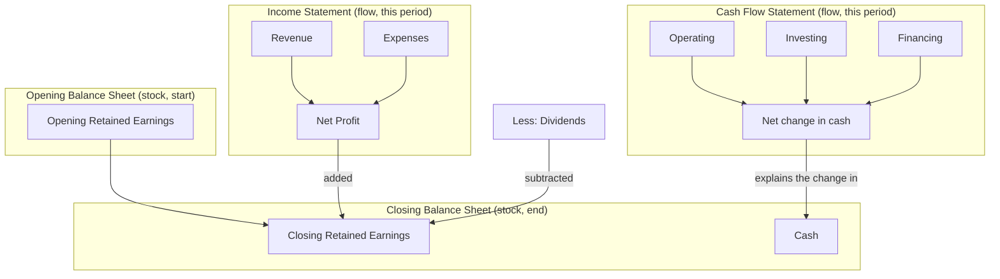

---
tags:
  - fra
  - topic
  - financial-statements
  - session-2
course: Financial Reporting & Analysis
syllabus: Session 2
dg-publish: false
---

# 02 · The Annual Report & the Three Financial Statements

> [!info] What this note covers
> The three statements at a glance · **stock vs flow** (the single most important distinction) · how the statements **articulate** (link together) · standalone vs consolidated · notes to the accounts. Detailed line-by-line treatment lives in [[03. Balance Sheet Assets]], [[04. Balance Sheet Equity and Liabilities]], [[05. Income Statement PandL]] and [[06. Cash Flow Statement]].

---

## 1. The three statements at a glance

| Statement | Covers | The question it answers | Stock or flow? |
|---|---|---|---|
| [[03. Balance Sheet Assets\|Balance Sheet]] | A **point in time** (a snapshot, e.g. "as at 31 March 2026") | What does the firm **own** and **owe** *today*? | **Stock** |
| [[05. Income Statement PandL\|Income Statement / P&L]] | A **period** (e.g. "for the year ended 31 March 2026") | Did the firm earn a **profit** this period? | **Flow** |
| [[06. Cash Flow Statement\|Cash Flow Statement]] | A **period** | Where did **cash** come from and go? | **Flow** |

### Stock vs flow
> [!tip] Stock vs flow — the distinction to burn in
> A **stock** is measured *at an instant* (like the water level in a tank). A **flow** is measured *over an interval* (like litres flowing per hour). The **balance sheet is a stock**; the **P&L and cash flow are flows**. This is why a balance sheet is dated *"as at"* a date, while the other two are *"for the year ended."* Get this and half the intuition falls out for free.

---

## 2. How the three statements link (articulation)

The statements are **not three unrelated documents** — they interlock. This is called **articulation**, and it is a favourite conceptual exam theme.

Two bridges do all the work:

1. **P&L → Balance Sheet (via retained earnings).**
   $$\text{Closing Retained Earnings} = \text{Opening Retained Earnings} + \text{Net Profit} - \text{Dividends}$$
   The profit computed on the income statement doesn't vanish — it is **ploughed back into equity** through retained earnings. (This is exactly the [[08. The Accounting Equation#The expanded equation|expanded accounting equation]] in motion.)

2. **Cash Flow → Balance Sheet (via cash).** The net change in cash on the cash flow statement equals the change in the **Cash and cash equivalents** line between the opening and closing balance sheets.

> [!example] Seen live in HUL FY26
> - **Retained-earnings bridge:** HUL earned ~₹15,059 cr profit, paid ~₹10,124 cr dividends; net worth's *Other Equity* moved accordingly (see [[04. Balance Sheet Equity and Liabilities]]).
> - **Cash bridge:** the [[06. Cash Flow Statement|cash flow statement]] shows a net decrease of **−₹3,495 cr**, which is exactly why cash on the [[03. Balance Sheet Assets|balance sheet]] fell from **6,071 → 2,583**. The statements reconcile.

---

## 3. Why we need all three (profit ≠ cash)

A natural question: if the P&L already shows profit, why bother with a cash flow statement?

Because **profit and cash are different things.** Under [[07. Conceptual Framework and Core Concepts#Accrual basis|accrual accounting]], revenue is booked when *earned* and expenses when *incurred* — regardless of when cash actually moves. So:

- A firm can be **profitable but cash-poor** (sold lots on credit — profit booked, cash not yet in).
- A firm can be **cash-rich but loss-making** (collected advances, sold assets).
- Profit contains **non-cash items** (depreciation, one-off paper gains) that the cash flow statement strips out.

> [!example] HUL: the clearest possible illustration
> HUL's reported profit (~₹15,059 cr) *far exceeded* its operating cash flow (~₹10,999 cr), largely because profit included a **₹4,611 cr non-cash gain on the ice-cream demerger**. Profit told you the accounting result; the cash flow statement told you the *cash reality*. You need both.

---

## 4. Notes to the Financial Statements

The face of each statement is deliberately compact — often one line where reality is complicated. The **notes** (also "notes to accounts" / "schedules") carry the detail and are an **integral, audited part** of the statements. They contain:

- The **basis of preparation** and **material accounting policies** (which is the discretion in [[07. Conceptual Framework and Core Concepts|thrust 3]] — e.g. depreciation method, inventory valuation, revenue-recognition policy).
- **Line-item breakdowns** — e.g. what's inside "Other expenses," the ageing of receivables, the movement in PPE.
- **Contingent liabilities and commitments** — obligations *disclosed* but not recognised (see [[04. Balance Sheet Equity and Liabilities#Contingent liabilities]]).

> [!tip] Exam framing
> On the HUL statements, note numbers (e.g. "Note 3," "Note 27") point to these. The line "The accompanying notes 1 to 55 are an integral part of these consolidated financial statements" is the standard flag that **the statements are incomplete without the notes.**

---

## 5. Standalone vs Consolidated

| | **Standalone** | **Consolidated** |
|---|---|---|
| Scope | The parent's own legal entity only | Parent **+ subsidiaries** as one economic entity |
| Subsidiaries shown as | A single line: *"Investment in Subsidiary"* (at cost) | Added line-by-line (100% of assets & liabilities) |
| Unique line items | — | **Goodwill**, **Non-controlling interest (NCI)** |
| Answers | "How is the parent company doing?" | "How is the whole **group / empire** doing?" |

- A **subsidiary** = the parent controls it (typically **> 50%** holding). Fully consolidated.
- An **associate** = the parent has *significant influence* but not control (typically **20–50%**). Brought in by the **[[03. Balance Sheet Assets#Equity-method investments|equity method]]**, not full consolidation.

> [!warning] Consolidation creates items that don't exist standalone
> **Goodwill** and **NCI** only appear on *consolidated* statements. If you see NCI, you're reading a consolidated statement — as with all the HUL statements in this vault.

> [!example] HUL is consolidated
> Its titles read "Consolidated Balance Sheet / Statement of Profit and Loss / Statement of Cash Flows," it carries **Goodwill ₹18,062 cr** and **NCI ₹269 cr**, and profit is split between "Owners of the Holding Company" and "Non-controlling interests." All three are consolidation fingerprints.

---

## Key takeaways

- Three statements: **Balance Sheet (stock)**, **P&L (flow)**, **Cash Flow (flow)**.
- They **articulate**: profit flows into the balance sheet via **retained earnings**; the change in cash on the cash flow statement equals the change in the balance sheet's cash line.
- You need all three because **profit ≠ cash** (accrual accounting + non-cash items).
- The **notes** are an integral, audited part — that's where accounting policies and detail live.
- **Consolidated** statements add subsidiaries line-by-line and uniquely show **goodwill** and **NCI**.

---

**Related:** [[01. Firm Governance and Reporting Environment]] · [[03. Balance Sheet Assets]] · [[05. Income Statement PandL]] · [[06. Cash Flow Statement]] · [[08. The Accounting Equation]]
