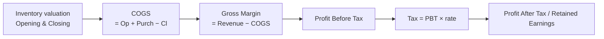
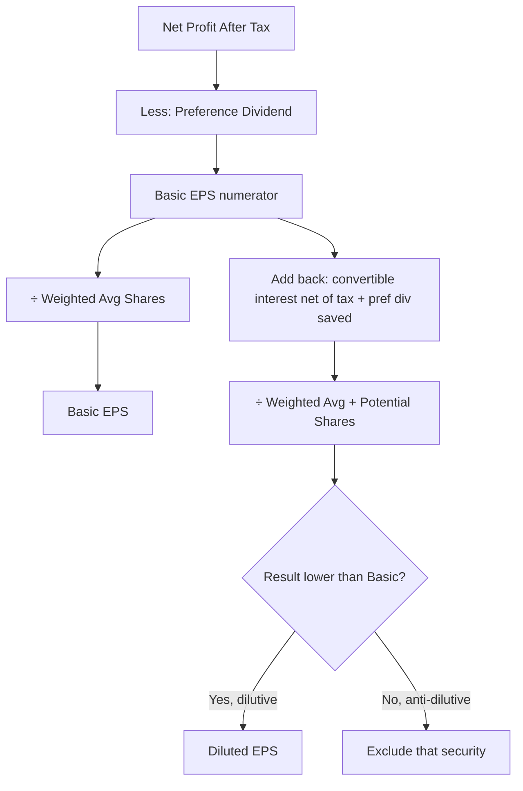

---
tags:
  - fra
  - topic
  - income-statement
  - pandl
  - eps
  - session-2
  - session-3
course: Financial Reporting & Analysis
syllabus: Session 2 / Session 3
dg-publish: false
---

# 05 · The Income Statement (Profit & Loss)

> [!info] What this note covers
> What the P&L measures and its structure down to PAT · revenue vs other income · expenses **by nature** (the Ind AS way) · the **"changes in inventories"** line and **how inventory valuation flows into COGS, gross margin and tax** · depreciation/amortisation · exceptional & discontinued items · **EPS — basic and diluted** (with convertible-debenture logic) · the HUL P&L read in full.

---

## 1. What the P&L measures

> [!note] Definition
> The **Income Statement (Statement of Profit & Loss)** measures **financial performance over a period** — it reports how much **profit** the firm earned by matching the period's **revenues** against the **expenses** incurred to earn them.

It is a **flow** statement (contrast the balance-sheet **stock** — see [[02-The-Annual-Report-and-Three-Statements#Stock vs flow|Stock vs flow]]). Its bottom line, **net profit**, flows into the balance sheet through **retained earnings** — the bridge that makes the statements articulate.

$$\text{Profit} = \text{Revenue} - \text{Expenses}$$

The result belongs to **equity**: profit *increases* equity, a loss *decreases* it (via retained earnings). This is the [[08-The-Accounting-Equation#The expanded equation|expanded accounting equation]] made concrete.

---

## 2. The structure — from revenue down to PAT

Indian statements (Schedule III / Ind AS) present expenses **by nature**, giving this skeleton:

```
  Revenue from operations
+ Other income
= TOTAL INCOME
− Expenses (by nature: materials, purchases, changes in inventory,
            employee benefits, finance costs, depreciation, other)
= Profit before exceptional items and tax (PBT before exceptionals)
± Exceptional items
= Profit Before Tax (PBT)
− Tax (current + deferred)
= Profit After Tax (PAT) / Profit for the year
```

Then EPS is reported at the foot, and **Other Comprehensive Income (OCI)** is shown below PAT to reach **Total Comprehensive Income**.

---

## 3. Revenue vs other income

- **Revenue from operations** — total income from the firm's **core, day-to-day activities** (selling its goods/services). The top line.
- **Other income** — income **not** from core operations: interest earned, dividends received, gains on investments.

> [!warning] Revenue = cash sales **and** credit sales
> Revenue is recognised when **earned**, not when cash arrives. So both **cash sales and credit sales** count as revenue in the period the sale happens. **Quiz 1 Q11** tests exactly this ("both cash sales and credit sales"). Purchases are *not* revenue — they're an expense/asset. Ties to [[07-Conceptual-Framework-and-Core-Concepts#Revenue recognition|Revenue recognition]].

---

## 4. Expenses by nature

| Expense head                                                                                                                                                               | What it covers                                                                 |
| -------------------------------------------------------------------------------------------------------------------------------------------------------------------------- | ------------------------------------------------------------------------------ |
| **Cost of materials consumed**                                                                                                                                             | Raw materials used in production: *Opening RM + Purchases − Closing RM*        |
| **Purchases of stock-in-trade**                                                                                                                                            | Goods bought for **resale without processing** (the trading side)              |
| **[[05-Income-Statement-PandL#5. The "Changes in inventories" line — and the inventory → COGS → margin → tax chain\|Changes in inventories of FG, WIP & stock-in-trade]]** | Adjustment line reconciling *produced* vs *sold*                               |
| **Employee benefits expense**                                                                                                                                              | Wages, salaries, welfare, share-based payments                                 |
| **Finance costs**                                                                                                                                                          | Interest on borrowings and leases                                              |
| **[[03-Balance-Sheet-Assets#5. Depreciation, amortisation & depletion (the allocation idea)\|Depreciation & amortisation]]**                                               | Allocation of long-lived asset cost                                            |
| **Other expenses**                                                                                                                                                         | Indirect operating costs: rent, insurance, selling & distribution, power, etc. |

> [!note] "By nature," not "by function" — so there is **no single COGS line**
> Ind AS classifies expenses by **nature** (materials, employees, depreciation…), *not* by **function** (COGS, selling, admin). So you won't see a "Cost of Goods Sold" line on an Indian P&L — production costs are **spread across several nature lines**, and the "changes in inventories" line stitches them into the true COGS (next section).

---

## 5. The "Changes in inventories" line — and the inventory → COGS → margin → tax chain

This is the line students find most confusing, and the one your syllabus specifically wants connected end-to-end.

> [!abstract] One-liner
> **Changes in inventories** is an **adjustment** on the expense side that corrects the timing gap between what was **produced** and what was actually **sold**.

Not everything produced this year was sold this year. Production costs sit in the *materials / employee / other* lines in full, but some of that output went into **closing stock** (an asset), not into this year's sales. This line strips that out.

$$\text{Changes in inventories} = \text{Opening Inventory} - \text{Closing Inventory}$$

> [!note] The sign convention (the confusing part)
> - **Inventory grows** (Closing > Opening) → line is **negative** → **reduces** expenses. Some production cost is *stored* for a future period, so it shouldn't hit this year's P&L.
> - **Inventory shrinks** (Closing < Opening) → line is **positive** → **adds** to expenses. Old stock was sold down, so prior-period cost is charged now.
>
> A growing firm often shows this as a **bracketed negative** — an "expense" that *reduces* the total. That's correct.

> [!example] Worked example — deriving true COGS
> | Item | ₹ |
> |---|---:|
> | Opening finished goods | 100 |
> | Production costs incurred (sitting in other lines) | 1,000 |
> | Closing finished goods | 150 |
> | **Changes in inventory** (100 − 150) | **(50)** |
> | **Net cost charged to P&L** | **950** |
>
> The ₹950 **is** the true COGS: the full ₹1,000 sits in production lines; this line removes the ₹50 that went into closing stock. **Raw-material change is already captured** in *Cost of materials consumed* (Opening RM + Purchases − Closing RM) — this line covers **output** inventory (FG, WIP, stock-in-trade) only.

### How it flows through to gross margin and tax (the linkage question)

This is the connection to *hold onto* — a change in inventory **valuation** ripples all the way to tax:



Trace it: **higher closing inventory → lower COGS → higher gross margin → higher PBT → higher tax → higher PAT** (and vice versa). So the *estimate* of closing inventory value is not a footnote — it moves the tax bill and the bottom line.

> [!example] Numeric illustration of the chain
> Revenue = 2,000; production cost incurred = 1,000; tax rate = 25%.
> - **Case A — closing FG = 150** → COGS = 1,000 − (150−100) = 950 → Gross margin = 1,050 → tax = 262.5 → **PAT = 787.5**.
> - **Case B — closing FG = 250** (higher valuation) → COGS = 1,000 − (250−100) = 850 → Gross margin = 1,150 → tax = 287.5 → **PAT = 862.5**.
>
> Same physical activity; a ₹100 higher closing-inventory valuation raised gross margin by ₹100, tax by ₹25, and PAT by ₹75. **This is why inventory-valuation policy (FIFO vs weighted average, write-downs) is a live area of [[07-Conceptual-Framework-and-Core-Concepts|managerial discretion]].**

> [!tip] The balance-sheet mirror
> The ₹100 of extra closing inventory doesn't disappear — it sits as a **current asset** on the [[03-Balance-Sheet-Assets|balance sheet]]. Income statement and balance sheet move together: cost either becomes an **expense now** (through COGS) or an **asset carried forward** (inventory). That either/or is the whole game.

---

## 6. Below the operating line

### Exceptional items
Significant gains or expenses from ordinary activities that are **unusually large, infrequent, or one-off**. Shown **separately** so readers can judge **core** operating performance without them.

### Discontinued operations
A business line being **sold or shut down** is reported **separately** from continuing operations, so the ongoing business is visible on its own.

> [!example] HUL FY26 — why the headline profit is misleading
> HUL's profit jumped 10,671 → **15,059**, but profit from **continuing** operations was **flat** (10,680 → 10,652). The jump came almost entirely from **discontinued operations** — a **₹4,471 cr exceptional credit on the ice-cream demerger**. That is a **one-time gain, not operating performance.** *Always separate continuing from discontinued results when judging a business.* (And note: this gain was **non-cash**, so the [[06-Cash-Flow-Statement|cash flow statement]] strips it back out.)

### Tax — current vs deferred
- **Current tax** — tax payable on this year's taxable profit.
- **Deferred tax** — timing differences between accounting profit and taxable profit (e.g. depreciation differences) that reverse in future.

### Other Comprehensive Income (OCI)
Gains/losses that **bypass profit** but still **change equity** — e.g. fair-value changes on certain hedges/investments, pension remeasurements. **PAT + OCI = Total Comprehensive Income.**

> [!note] HUL FY26: OCI = +202, so Total Comprehensive Income (15,261) > PAT (15,059).

---

## 7. Earnings Per Share (EPS)

> [!abstract] One-liner
> **EPS** shows how much **net profit is attributable to each equity share.** It's the last line on the P&L (Ind AS 33 / AS 20) and the denominator's partner in the **P/E ratio**.

### Basic EPS
$$\text{Basic EPS} = \frac{\text{Net Profit attributable to equity shareholders}}{\text{Weighted Avg. no. of equity shares}}$$

> [!note] Two numerator adjustments
> - **Subtract preference dividends** — they belong to preference holders, not equity.
> - Use profit **after tax** and after **NCI**.

**Weighted average shares** — shares issued mid-year count only for the fraction of the year they were outstanding:

| Event | Shares | Months out | Weighted |
|---|---:|---:|---:|
| Opening (1 Apr) | 10,00,000 | 12/12 | 10,00,000 |
| Fresh issue (1 Oct) | 4,00,000 | 6/12 | 2,00,000 |
| **Weighted avg** | | | **12,00,000** |

If PAT = ₹36,00,000, pref dividend = 0 → **Basic EPS = 36,00,000 / 12,00,000 = ₹3.00**.

### Diluted EPS
> [!abstract] Idea
> Diluted EPS asks: *"What would EPS be if every potential equity share actually converted?"* It's a **conservative, worst-case** figure warning shareholders about **future dilution**.

**Potential equity shares:** convertible debentures, convertible preference shares, **ESOPs & warrants**, any contract that could create new shares.

$$\text{Diluted EPS} = \frac{\text{Adjusted Net Profit}}{\text{Weighted Avg. shares} + \text{Potential shares}}$$

> [!note] Both numerator AND denominator change ("if-converted" method)
> - **Denominator:** add the potential new shares.
> - **Numerator:** add back expense saved on conversion — e.g. **interest on convertible debt (net of tax)** disappears once it becomes equity; preference dividends stop.
>
> **Why "net of tax"?** Interest is tax-deductible — a **tax shield**. If the debt converts, the firm loses both the interest expense *and* its tax shield, so the true benefit added back is:
> $$\text{Add-back} = \text{Interest} \times (1 - \text{Tax Rate})$$

> [!example] Worked example — convertible debentures
> Continuing above: PAT ₹36,00,000; weighted avg shares 12,00,000. Convertible debentures: interest ₹3,00,000/yr, tax 30%, convert into 2,00,000 shares.
> - **Numerator:** interest saved net of tax = 3,00,000 × (1 − 0.30) = ₹2,10,000 → adjusted profit = 38,10,000.
> - **Denominator:** 12,00,000 + 2,00,000 = 14,00,000.
> $$\text{Diluted EPS} = \frac{38,10,000}{14,00,000} = 2.72$$
> Basic ₹3.00 → Diluted ₹2.72. The drop **is** the dilution warning.

> [!warning] Anti-dilutive securities are ignored
> If including a potential share would *increase* EPS (make it look better), it is **excluded**. **Diluted EPS can never exceed Basic EPS** — only equal or lower.



> [!example] HUL FY26
> Face value ₹1/share. **Basic EPS ₹64.01** (₹45.25 continuing + ₹18.76 discontinued); **Diluted ₹64.00** — barely below basic, because HUL has almost no dilutive instruments. The big discontinued-ops slice (₹18.76) is the ice-cream gain again.

---

## 8. Applied example — HUL P&L (FY26) in one glance

> [!example] (₹ cr)
> | | FY26 | FY25 |
> |---|---:|---:|
> | Revenue from operations | 64,468 | 61,328 |
> | Total expenses | 51,157 | 48,256 |
> | Profit before tax (continuing) | 13,812 | 14,428 |
> | Profit for the year (total) | **15,059** | 10,671 |
>
> - **Revenue +5%, continuing profit flat** — growth in the top line didn't reach the bottom line.
> - **Materials dominate:** materials (20,981) + purchases (11,113) ≈ **50% of revenue**; employees only ~5% — FMCG is **materials-heavy, not people-heavy**.
> - **"Changes in inventories" = −429** → inventory **built up**, deferring cost to the balance sheet.
> - **Headline jump is the demerger**, not operations (see §6).

---

## Common mistakes (Income Statement)

> [!warning] Gotchas
> - **Treating "changes in inventories" as a plain expense** — it's an *adjustment*; a bracketed negative is correct when stock grows.
> - **Looking for a "COGS" line** — there isn't one under Ind AS; expenses are by *nature*.
> - **Judging performance off the headline profit** — separate **continuing vs discontinued** and strip **exceptional** items first (HUL trap).
> - **Forgetting the tax shield in diluted EPS** — add back interest **× (1 − tax)**, not the full interest.
> - **Letting diluted EPS exceed basic** — impossible; anti-dilutive securities are excluded.
> - **Counting only cash sales as revenue** — credit sales are revenue too (Q11); advance received is **not** revenue yet (it's unearned/deferred — a liability).
> - **Not weighting shares issued mid-year** in EPS.

---

## Key takeaways

- P&L = **performance over a period**; profit flows to equity via **retained earnings**.
- Ind AS presents expenses **by nature** → **no COGS line**; the **changes-in-inventory** line reconstructs it.
- **Inventory valuation → COGS → gross margin → PBT → tax → PAT** — one continuous chain; the same cost is *either* an expense now *or* an asset carried forward.
- **Separate continuing/discontinued and exceptional items** before judging the business.
- **EPS**: basic = profit ÷ weighted-avg shares; diluted assumes conversion (add potential shares; add back interest **net of tax**); diluted ≤ basic.

---

**Related:** [[03-Balance-Sheet-Assets]] · [[04-Balance-Sheet-Equity-and-Liabilities]] · [[06-Cash-Flow-Statement]] · [[07-Conceptual-Framework-and-Core-Concepts]] · [[HUL P&L]] · [[90-Master-Formula-Sheet]]
