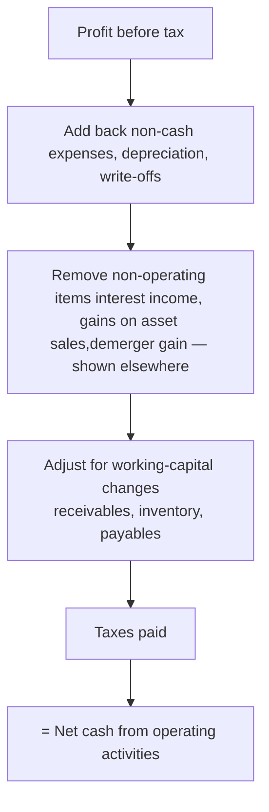

---
tags:
  - fra
  - topic
  - cash-flow
  - session-2
course: Financial Reporting & Analysis
syllabus: Session 2
dg-publish: false
---

# 06 · The Cash Flow Statement

> [!info] What this note covers
> Why a cash flow statement exists (**profit ≠ cash**) · the **three activities** (operating, investing, financing) and how they map to the four managerial decisions · the **indirect method** step by step · the HUL cash flow read in full. Structure/linkage context is in [[02-The-Annual-Report-and-Three-Statements]].

---

## 1. Why a separate cash statement?

The P&L is prepared on the **[[07-Conceptual-Framework-and-Core-Concepts#Accrual basis|accrual basis]]**: revenue is booked when *earned* and expenses when *incurred*, regardless of when cash moves. That is the right way to measure **performance** — but it means **profit is not cash.** A firm can report a healthy profit and still run out of money.

> [!tip] The core message — profit ≠ cash
> Profit and cash differ because of (a) **credit** — sales booked but not yet collected, costs incurred but not yet paid; (b) **non-cash items** — depreciation, one-off paper gains/losses; and (c) **capital flows** — buying assets, raising/repaying loans, paying dividends never touch the P&L but drain or fill cash. The cash flow statement re-tells the year purely in **cash** terms.

---

## 2. The three activities

Every cash movement is sorted into one of three buckets — which line up neatly with the **four managerial decisions** from [[01-Firm-Governance-and-Reporting-Environment#The four managerial decisions]]:

| Section | Captures | Managerial decision |
|---|---|---|
| **Operating (CFO)** | Cash from **core trading** — customers, suppliers, employees, tax | Working-capital management |
| **Investing (CFI)** | Buying/selling **long-term assets & investments** (capex, acquisitions) | Investment / capital-allocation |
| **Financing (CFF)** | Raising/repaying **capital** — equity, borrowings, **dividends** | Financing & dividend |

$$\text{Net change in cash} = \text{CFO} + \text{CFI} + \text{CFF}$$

And that net change **must equal** the movement in the balance-sheet cash line (articulation — see [[02-The-Annual-Report-and-Three-Statements#How the three statements link]]).

> [!note] Reading the *pattern* of signs
> - A **healthy mature firm**: CFO **positive** (core generates cash), CFI **negative** (investing for the future), CFF **negative** (returning cash via dividends/debt repayment). ← this is HUL.
> - A **young growth firm**: CFO negative/small, CFI very negative (heavy investment), CFF positive (raising capital to fund it).
> The mix tells you the firm's life-stage at a glance.

---

## 3. The indirect method (Ind AS 7)

There are two ways to present operating cash flow. The **indirect method** (used by almost all Indian firms, including HUL) starts from **profit** and *works back* to cash. The logic:

Step by step:

1. **Start with profit before tax.**
2. **Add back non-cash expenses** — chiefly **depreciation & amortisation** (it reduced profit but no cash left the firm), plus write-offs.
3. **Remove non-operating items** that belong in other sections or aren't cash: subtract **interest income** and **gains on sale of assets** (they'll appear in investing), subtract **non-cash gains** (like a demerger gain), add back **interest expense** (it'll appear in financing).
4. **Adjust for working-capital changes:**
   - Receivables **↑** → cash tied up → **subtract**. Receivables ↓ → **add**.
   - Inventory **↑** → cash tied up → **subtract**.
   - Payables **↑** → cash conserved (suppliers financing you) → **add**.
5. **Deduct taxes actually paid.**
   → **Net cash from operating activities.**

> [!warning] Why depreciation is "added back" — it is *not* a source of cash
> Adding depreciation back does **not** mean depreciation generates cash. It was subtracted to compute profit but involved **no cash outflow**, so to get from profit to cash you must *reverse* that subtraction. The cash left when the asset was **bought** (that sits in *investing*).

---

## 4. Applied example — HUL cash flow (FY26)

> [!example] HUL consolidated cash flow, indirect method (₹ cr)
> | Section | FY26 |
> |---|---:|
> | **Operating (CFO)** | **+10,999** |
> | **Investing (CFI)** | **−3,684** |
> | **Financing (CFF)** | **−10,810** |
> | **Net change in cash** | **−3,495** |
> | Opening cash | 6,070 |
> | Closing cash | **2,583** |
>
> **The one-paragraph story:** Operations threw off **+10,999**. Investing used **−3,684** — mainly a **₹2,661 cr acquisition** plus ~₹1,258 cr capex. Financing used **−10,810** — almost entirely **dividends of ₹10,124 cr**. Net, cash fell **−3,495**, which is *exactly* why the [[HUL Balance Sheet|balance sheet]] cash line dropped **6,071 → 2,583**. The three sections reconcile to the balance sheet.

> [!example] Profit ≠ cash, proven on HUL
> Reported profit ~**15,059** but CFO only **10,999**. The gap is dominated by the **₹4,611 cr non-cash gain on the ice-cream demerger** — real accounting profit, **zero cash** — so the indirect method *subtracts* it near the top. This is the single clearest illustration in the whole vault of why you cannot judge cash from the P&L.

> [!note] Classification choices to watch
> HUL removes **interest & dividend income** from operating (shown under investing: received 428 + 5) and puts **interest paid** under financing. These classification choices are permitted options under Ind AS 7 and shift where cash appears — a subtle analysis point.

> [!tip] Working capital, HUL-style
> Current liabilities rose **+1,476** (suppliers financing operations) while inventories consumed **−692** — consistent with the payables-heavy [[04-Balance-Sheet-Equity-and-Liabilities|balance sheet]]. HUL pays out ~**92%** of operating cash flow as dividends — a mature **cash cow**, not a reinvestment-hungry grower.

---

## 5. The Maria Hernandez lesson (same idea, small scale)

> [!example] Profit up, cash down — a mini cash-flow puzzle
> In [[09-The-Accounting-Cycle-Recording-Transactions#5. Worked case — Maria Hernandez & Associates|Maria Hernandez & Associates]], the business earned a **₹4,600 profit** yet cash **fell ₹5,400**. Where did the cash go? Into **receivables** (₹7,000 uncollected), **prepaid rent** and **supplies** on hand, and **new equipment** (₹5,500 cash) — while non-cash **depreciation** (₹1,500) reduced profit without touching cash. It's the HUL story in miniature: *profitability and liquidity are different questions.*

---

## Common mistakes (Cash Flow)

> [!warning] Gotchas
> - **Treating depreciation as a cash inflow** — it's a non-cash **add-back**, not a source of cash.
> - **Leaving non-cash gains in operating** — a demerger/asset-sale gain must be **removed** (it's non-operating and/or non-cash).
> - **Confusing profit with CFO** — accrual vs cash; they rarely match.
> - **Mis-signing working capital** — asset ↑ = cash **out** (subtract); liability ↑ = cash **in** (add).
> - **Putting dividends in operating** — dividends **paid** are **financing**.
> - **Forgetting the net change must tie to the balance-sheet cash movement.**

---

## Key takeaways

- The cash flow statement exists because **profit ≠ cash** (accrual + non-cash + capital flows).
- Three sections — **operating, investing, financing** — map to the **four managerial decisions**; their sign pattern reveals the firm's life-stage.
- **Indirect method:** start at profit, add back non-cash, remove non-operating, adjust working capital, deduct tax paid → CFO.
- HUL: **+10,999 / −3,684 / −10,810 = −3,495**, reconciling to the balance-sheet cash drop; the demerger gain proves profit ≠ cash.

---

**Related:** [[02-The-Annual-Report-and-Three-Statements]] · [[05-Income-Statement-PandL]] · [[07-Conceptual-Framework-and-Core-Concepts]] · [[HUL Cash Flow Statement]] · [[09-The-Accounting-Cycle-Recording-Transactions]]
