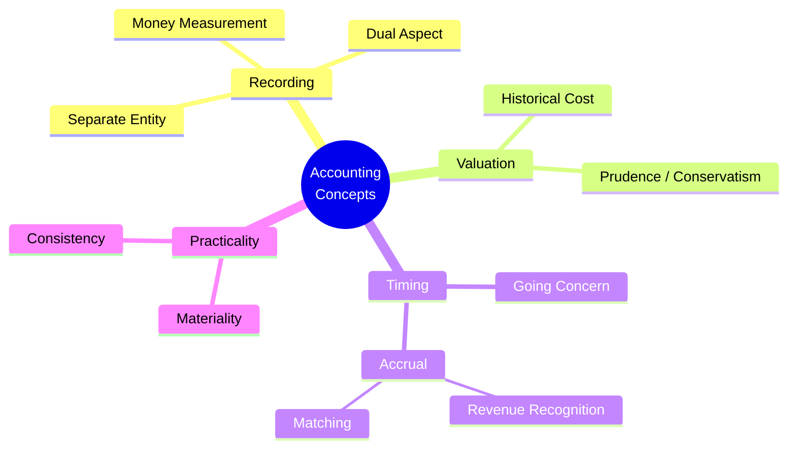

---
tags:
  - fra
  - topic
  - concepts
  - conceptual-framework
  - session-3
course: Financial Reporting & Analysis
syllabus: Session 3 (Part B)
dg-publish: false
---

# 07 · The Conceptual Framework & Core Accounting Concepts

> [!info] What this note covers
> The set of foundational **concepts** that govern *how* every transaction is recorded: separate entity, dual aspect, money measurement, historical cost, going concern, accrual, matching, revenue recognition, materiality, prudence/conservatism, consistency. These are the "grammar" of accounting — every later topic obeys them. Quiz 1 tests them **directly** (Q2, Q4, Q7, Q8, Q9, Q14, Q16).

---

## 1. Why a conceptual framework?

Accounting could be arbitrary — but then no two firms' statements would be comparable, and managers ([[01. Firm Governance and Reporting Environment|agents]]) could shape the numbers at will. The **conceptual framework** is the shared logic — a small set of concepts — that makes statements **consistent, comparable and reliable.** Learn these and most "why is it recorded this way?" questions answer themselves.

---

## 2. The concepts, one by one

### Separate Entity (Business Entity) Concept
> [!note] The business is treated as **distinct from its owners.** Its accounts are kept from the **business's** point of view, not the owner's.

When an owner puts money in, the business **owes it back** to them — so the owner's stake is recorded as **Equity**, a claim on the business. That is precisely why **equity sits on the same side as liabilities** (both are claims on the firm): see [[04. Balance Sheet Equity and Liabilities#Why equity and liabilities sit on the same side]].

> [!example] Owner's drawings
> When Smith withdraws ₹1,000 for personal use (Music Mart event 8), it's *not* a business expense — it's a **reduction of his equity** (drawings). The business and Smith are separate; money crossing between them changes equity, not profit.

### Dual Aspect (Duality) Concept
> [!note] Every transaction has **two equal and opposite effects**, keeping **Assets = Liabilities + Equity** in balance at all times.

This is the engine of **[[09. The Accounting Cycle Recording Transactions|double-entry]]**. Buy inventory on credit → an asset (inventory) **and** a liability (payable) both rise by the same amount.

> [!question] Quiz 1 Q3 — a transaction affects how many accounts?
> **Two or more** ("c"). The minimum is two (dual aspect); some transactions touch more (e.g. a credit sale with COGS touches four — the *double* dual aspect below).

> [!tip] The "double dual aspect" of a sale (from the Music Mart discussion)
> A sale on credit has **two** dual aspects at once:
> 1. **Revenue side:** Cash/Receivable ↑ and Sales (revenue → equity) ↑.
> 2. **Cost side:** COGS (expense → equity ↓) and Inventory ↓.
> Recognising the sale forces you to *also* record the cost of what was sold — which is the **matching concept** in action.

### Money Measurement Concept
Only things measurable in **money** are recorded. A brilliant workforce or loyal customers don't appear as assets — hence internally generated goodwill stays off the books (see [[03. Balance Sheet Assets#Goodwill|Goodwill]]).

### Historical Cost Concept
> [!note] Assets are recorded at their **original acquisition cost**, not current market value.

So land bought years ago stays at cost even if worth far more today.

> [!example] Music Mart events 7 & 10 (historical cost + realisation)
> - Event 7: a ₹33,000 offer for a business with ₹26,970 equity implies ₹6,030 of goodwill — **not recorded** (internally generated + not transacted).
> - Event 10: a third party resells the neighbouring lot for ₹14,000 — Music Mart does **not** write up its own identical lot. Historical cost holds until an actual transaction occurs.
>
> **Fair value** is a later refinement — your notes flag using **historical cost until the midterm**, then introducing **fair value**.

### Going Concern Concept
Statements assume the business will **continue operating** for the foreseeable future. That's why assets are carried at cost (to be *used*), not at fire-sale liquidation values — the firm isn't about to be wound up.

> [!example] Lone Pine Cafe — going concern *fails*
> When the partnership is **dissolved**, the going-concern assumption breaks. Values you'd normally carry at cost become questionable (would the equity actually be realisable on a forced wind-up?). See the discussion in [[09. The Accounting Cycle Recording Transactions#6. Worked case — Lone Pine Cafe (A & B)| Lone Pine Cafe]].

### Accrual Concept
> [!note] Revenue and expenses **pertaining to a period are recognised in that period, regardless of when cash moves.**

The opposite is the **cash basis** (record only when cash is received/paid), which is simpler but distorts performance — a big credit sale would show *zero* revenue until payment. Accrual rests on two sub-principles: **revenue recognition** and **matching** (below). The mismatch between *when cash moves* and *when we recognise* creates four accrual accounts:

| | Cash moves **before** recognition | Cash moves **after** recognition |
|---|---|---|
| **Revenue** | Unearned / deferred revenue → **liability** | Accounts receivable / accrued revenue → **asset** |
| **Expense** | Prepaid expense → **asset** | Accounts payable / accrued expense → **liability** |

Worked mini-cases:
- **Accounts receivable** — sold on credit; revenue earned now, cash later → **asset**.
- **Accounts payable** — bought on credit; expense now, paid later → **liability**.
- **Prepaid expenses** (prepaid rent/insurance/advance salary) — cash paid up front, benefit consumed later → **asset** until it expires into expense.
- **Unearned (deferred) revenue** — cash collected in advance (subscription, customer advance) → **liability** until service delivered.
- **Accrued expenses** (salaries/interest payable) — cost incurred but unpaid at period-end → **liability**.

> [!question] Quiz 1 Q4 — the method reporting expenses when *incurred* (not paid)?
> **Accrual** basis.

> [!warning] Quiz 1 Q8 & Q9 — the prepaid/accrued timing traps
> - **Q8:** JK Stores paid **April 2024 salary in advance on 31 Mar 2024.** Impact on FY2023-24 profit? **No effect** — it's a **prepaid expense (asset)**; the benefit belongs to April (next year). Cash left, but no expense this year.
> - **Q9:** JK Stores paid **March 2024 rent on 1 April 2024.** Impact on FY2023-24 profit? **Decrease** — under accrual, March rent is a **March expense** (accrued at year-end), even though paid next year. *When cash moves is irrelevant; when the benefit is consumed is everything.*

### Revenue Recognition
Record revenue when it is **earned** — goods delivered / service performed — **not** when cash arrives. So an **advance received is not yet revenue** (it's unearned → a liability); a **completed credit sale is revenue** even before collection.

> [!example] Maria Hernandez
> Her ₹47,000 revenue = ₹40,000 collected **+ ₹7,000 still owed** for work already **completed and delivered.** The ₹7,000 is earned → recognised now as revenue (with a receivable), even though uncollected. See [[09. The Accounting Cycle Recording Transactions#5. Worked case — Maria Hernandez & Associates|Maria Hernandez]].

### Matching Concept
> [!note] **Match expenses to the revenues they helped generate** — recognise a cost in the *same* period as the revenue it produced (or when its benefit is consumed).

> [!tip] "Cost of goods **sold**" — you were already doing it
> When you compute COGS, note the word *sold*: you charge as expense only the cost of the inventory that was **sold**, matching it against the sale's revenue. The rest stays as an **asset** (inventory) — the [[05. Income Statement PandL#5. The "Changes in inventories" line — and the inventory → COGS → margin → tax chain|either-expense-now-or-asset-later]] idea. Depreciation is matching too: the asset's cost is spread across the periods it helps earn revenue.

> [!note] Asset vs expense, restated
> An **asset** is a source of **future** (unexpired) benefit; an **expense** is a source of **expired** benefit. Prepaid insurance is an asset today; each month a slice *expires* into insurance expense. Quiz 1 **Q5** (expired prepaid rent → **Expense**) and **Q14/Q17** hinge on this.

### Materiality Concept
> [!note] An item too small to affect a user's decisions need not be tracked with full rigour — it can simply be **expensed.**

> [!example] Quiz 1 Q14 — a pen expensed rather than capitalised
> A pen *technically* has future benefit (an asset), but it's **immaterial** — so it's expensed. The answer is **Materiality** (not conservatism/consistency/disclosure). Same logic: steel dustbins, staplers.

### Prudence / Conservatism
Anticipate **losses**, not gains. Recognise probable losses early (create **provisions**, write inventory down to net realisable value) but don't book gains until realised. This underlies **provisions for doubtful debts/warranty** (see [[04. Balance Sheet Equity and Liabilities#Provisions|Provisions]]) and why anti-dilutive securities are ignored in EPS.

### Consistency
Apply the **same accounting policies period to period**, so results are comparable across years. A change in method (e.g. depreciation) must be disclosed. This is what makes **managerial discretion** visible and constrained.

---

## 3. How the concepts hang together

---

## Common mistakes (Concepts)

> [!warning] Gotchas
> - **Confusing cash timing with expense timing** — accrual keys off *when the benefit is consumed/earned*, not when cash moves (Q8, Q9).
> - **Treating owner's drawings as a business expense** — it's a reduction of **equity**, not a P&L item.
> - **Writing assets up to market value** — historical cost forbids it (until fair value is introduced post-midterm).
> - **Recording an advance received as revenue** — it's **unearned revenue**, a liability, until earned.
> - **Capitalising immaterial items** — materiality says expense the pen.
> - **Picking "conservatism" for the pen question** — it's **materiality** (Q14).

---

## Key takeaways

- The framework's concepts are the **grammar** every topic obeys.
- **Separate entity** → equity is a claim → sits with liabilities. **Dual aspect** → double-entry → equation always balances.
- **Accrual** (with **revenue recognition** + **matching**) decouples profit from cash and creates receivables/payables/prepaids/unearned revenue.
- **Historical cost + going concern** govern valuation; **materiality + prudence + consistency** keep it practical and comparable.
- These map directly onto Quiz 1 conceptual questions — see [[Past Papers (Worked)]].

---

**Related:** [[08. The Accounting Equation]] · [[09. The Accounting Cycle Recording Transactions]] · [[03. Balance Sheet Assets]] · [[05. Income Statement PandL]] · [[Past Papers (Worked)]]
