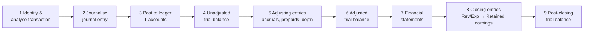

---
tags:
  - fra
  - topic
  - accounting-cycle
  - double-entry
  - session-4
course: Financial Reporting & Analysis
syllabus: Session 4
dg-publish: false
---

# 09 · The Accounting Cycle — Recording Transactions

> [!info] What this note covers
> The mechanics of turning raw transactions into statements: **debit/credit rules**, the **journal → ledger → trial balance → adjusting entries → statements** cycle, and **adjusting entries** (accruals, prepayments, depreciation). Then two capstone worked cases: **Maria Hernandez** (statement preparation with implicit transactions) and **Lone Pine Cafe A & B**.

> [!note] Why this note adds the most new material
> Your lecture notes were rich on *transaction-effect analysis* ([[08-The-Accounting-Equation]]) but light on the **debit/credit machinery** of Session 4. Sections 1–4 below fill that gap from first principles; sections 5–6 apply it to the cases.

---

## 1. The accounting cycle at a glance


The cycle repeats each period. Steps 1–4 happen continuously; steps 5–9 are the **period-end** close.

---

## 2. Debit and credit — the rules

Double-entry records every transaction in **two** places: a **debit** (left) and a **credit** (right), equal in amount. "Debit" and "credit" are just *left* and *right* — not "good/bad" or "increase/decrease." Whether a debit increases or decreases depends on the account type:

| Account type | Debit (Dr) | Credit (Cr) | Normal balance |
|---|---|---|---|
| **Asset** | **↑ increase** | ↓ decrease | Debit |
| **Expense** | **↑ increase** | ↓ decrease | Debit |
| **Liability** | ↓ decrease | **↑ increase** | Credit |
| **Equity / Capital** | ↓ decrease | **↑ increase** | Credit |
| **Revenue / Income** | ↓ decrease | **↑ increase** | Credit |

> [!tip] Mnemonic — **DEAD CLIC**
> **D**ebit increases: **E**xpenses, **A**ssets, **D**rawings.
> **C**redit increases: **L**iabilities, **I**ncome, **C**apital.

> [!note] Why this is just the accounting equation in disguise
> Assets = Liabilities + Equity (+ Rev − Exp). Assets and expenses are on the "uses/left" logic → **debit-normal**. Liabilities, equity and revenue are on the "sources/right" logic → **credit-normal**. Every journal entry keeps **total debits = total credits**, which is *why* the [[08-The-Accounting-Equation|equation]] never breaks.

---

## 3. Journal, ledger, trial balance

- **Journal entry** — the first record of a transaction, in Dr/Cr form. Example (share issue from [[04-Balance-Sheet-Equity-and-Liabilities#3. Share capital vs premium]]):
  ```
  Bank A/c                      Dr. 25,00,000
      To Equity Share Capital A/c        10,00,000
      To Securities Premium A/c          15,00,000
  ```
- **Ledger / T-account** — all entries for one account gathered together, so you can see its running balance. Debits on the left, credits on the right.
- **Trial balance** — a list of every account's closing balance, with debit balances in one column and credits in another. **The two columns must equal** — a first check that the books are arithmetically balanced (it doesn't catch every error, but a mismatch guarantees one).

---

## 4. Adjusting entries — the "implicit transactions"

Most transactions are **explicit** (an invoice, a payment). But at period-end, [[07-Conceptual-Framework-and-Core-Concepts#Accrual Concept|accrual]] requires **adjusting entries** for economic events that *happened* without a fresh document. These are the **"implicit transactions"** your notes stress. Five types:

| Type | Situation | Adjusting entry | Effect |
|---|---|---|---|
| **Accrued expense** | Cost incurred, not yet paid (interest, salaries) | Dr Expense / Cr Payable | Expense ↑, Liability ↑ |
| **Accrued revenue** | Earned, not yet billed/collected | Dr Receivable / Cr Revenue | Asset ↑, Revenue ↑ |
| **Prepaid expense expiring** | Paid in advance, benefit now consumed | Dr Expense / Cr Prepaid asset | Expense ↑, Asset ↓ |
| **Unearned revenue earned** | Cash taken in advance, now delivered | Dr Unearned (liability) / Cr Revenue | Liability ↓, Revenue ↑ |
| **Depreciation** | Long-lived asset's cost expiring | Dr Depreciation exp / Cr Accumulated dep'n | Expense ↑, Asset (net) ↓ |

> [!warning] The most-missed adjustments
> **Interest accrued but unpaid**, **prepaid rent/insurance expiring**, and **depreciation** are the three that examiners plant precisely because they involve **no cash movement** this period — so students forget them. In Maria Hernandez below, forgetting the ₹1,500 depreciation and ₹200 interest overstates profit.

---

## 5. Worked case — Maria Hernandez & Associates

A web-design consultancy. Maria believes she's profitable, yet **cash fell**. The case teaches: (a) splitting the expanded equation into a P&L + balance sheet, and (b) not forgetting **implicit (adjusting)** transactions.

### Opening balance sheet — 2 July 2004

She put in **$30,000** savings + **$20,000** loan from her father = $50,000, then spent on rent, equipment and supplies, leaving $12,000 cash:

| Assets | $ | Liabilities & Equity | $ |
|---|---:|---|---:|
| Cash in bank | 12,000 | Loan (father) | 20,000 |
| Office supplies | 5,000 | Maria's equity | 30,000 |
| Equipment & software | 27,000 | | |
| Prepaid rent | 6,000 | | |
| **Total** | **50,000** | **Total** | **50,000** |

*(Prepaid rent 6,000 = $3,000 security deposit + $3,000 July rent.)*

### Events over July–August (explicit) + adjustments (implicit)

**Explicit:**
1. Clients paid **$40,000**; two clients still owe **$7,000** for work **completed & delivered** → **Revenue = $47,000** (earned; [[07-Conceptual-Framework-and-Core-Concepts#Revenue Recognition|revenue recognition]]).
2. Bought supplies **$900** cash; supplies **on hand at 31 Aug = $4,200** → **supplies expense = 5,000 + 900 − 4,200 = $1,700**.
3. Paid rent **$6,000** (Aug **and** Sept) and **$33,000** cash for salaries, utilities, repairs.
4. Bought more equipment/software **$11,000** on 27 Aug — **$5,500 cash + $5,500 payable**.

**Implicit (adjusting):**
5. **Interest** on father's loan: 20,000 × 6% × (2/12) = **$200** accrued (unpaid) → accrued liability.
6. **Depreciation** on the original $27,000 equipment (3-year life): 27,000 ÷ 3 × (2/12) = **$1,500**. *(The 27-Aug equipment is ~4 days old → immaterial, ignored.)*
7. **Rent expense** = July $3,000 + August $3,000 = **$6,000**; the $3,000 September portion + $3,000 deposit remain → prepaid rent still $6,000.

### Income statement — 2 July to 31 Aug 2004

| | $ |
|---|---:|
| **Revenue** (earned) | **47,000** |
| Salaries, utilities, repairs | (33,000) |
| Rent expense | (6,000) |
| Office supplies expense | (1,700) |
| Depreciation | (1,500) |
| Interest | (200) |
| **Total expenses** | **(42,400)** |
| **Net profit** | **4,600** |

> [!example] Answer to Q1 — was it profitable, and why did cash fall?
> **Yes — profit was $4,600** (≈ **16% on $30,000 equity in just two months** — very healthy). Cash nonetheless fell **$5,400** (12,000 → 6,600) because cash was tied up in **receivables ($7,000 uncollected), prepaid rent and supplies on hand**, and a **capital purchase ($5,500 cash on new equipment)**, while non-cash **depreciation ($1,500)** cut profit without touching cash. **Profit ≠ cash** — the exact lesson of [[06-Cash-Flow-Statement]].

### Balance sheet — 31 Aug 2004

| Assets | $ | Liabilities & Equity | $ |
|---|---:|---|---:|
| Cash in bank | 6,600 | Loan (father) | 20,000 |
| Accounts receivable | 7,000 | Accounts payable (equipment) | 5,500 |
| Office supplies | 4,200 | Accrued interest | 200 |
| Prepaid rent | 6,000 | Maria's equity (30,000 + 4,600) | 34,600 |
| Equipment & software (net) | 36,500 | | |
| **Total** | **60,300** | **Total** | **60,300** |

*(Cash = 12,000 + 40,000 − 900 − 6,000 − 33,000 − 5,500 = 6,600. Equipment net = (27,000 + 11,000) − 1,500 dep'n = 36,500. Equity carries the $4,600 profit. It balances at $60,300 — the [[08-The-Accounting-Equation#The expanded equation|expanded equation]] split into two statements.)*

> [!tip] The teaching point
> The **profit lands in equity** (30,000 → 34,600), and the balance sheet only balances **because the implicit adjustments were made.** Miss the depreciation and interest and profit would be wrongly reported as $6,300, and the statement wouldn't tie.

---

## 6. Worked case — Lone Pine Cafe (A & B)

Three partners each contribute **$16,000**, buy out a cafe, run it a winter season; two partners then vanish and the partnership dissolves. Teaches balance-sheet and income-statement preparation from raw facts — and where the **[[07-Conceptual-Framework-and-Core-Concepts#Going Concern Concept|going-concern]]** assumption fails.

### Lone Pine (A) Q1 — Balance sheet at 2 Nov 2009 (formation)

Funds in = 3 × 16,000 contributions ($48,000) + $21,000 bank loan = **$69,000**. Uses: buyout $56,000 (**$53,200 equipment + $2,800 food/beverage**) + **$1,428 licenses** + **$1,400 cash register**; the remainder ($10,172) sits in checking.

| Assets | $ | Liabilities & Equity | $ |
|---|---:|---|---:|
| Cash (checking) | 10,172 | Bank loan | 21,000 |
| Food & beverage inventory | 2,800 | Partners' equity (3 × 16,000) | 48,000 |
| Prepaid licenses | 1,428 | | |
| Cash register | 1,400 | | |
| Equipment | 53,200 | | |
| **Total** | **69,000** | **Total** | **69,000** |

### Lone Pine (A) Q2 — Balance sheet at 30 Mar 2010 (dissolution)

Adjust for five months of operations and the theft:
- **Cash:** checking **$1,030** (the **$311** in the cash register vanished with the stolen register).
- **Accounts receivable:** ski instructors owe **$870** (earned, later paid).
- **Food & beverage on hand:** **$2,430**.
- **Prepaid licenses:** $1,428 × 7/12 remaining ≈ **$833** (5 of 12 months expired).
- **Equipment (net):** 53,200 − **$2,445** depreciation = **$50,755**.
- **Cash register:** **removed entirely** — stolen (a $1,400 loss, plus the $311 inside).
- **Bank loan:** 21,000 − $2,100 repaid = **$18,900**.
- **Accounts payable:** suppliers owed **$1,583**.

| Assets | $ | Liabilities & Equity | $ |
|---|---:|---|---:|
| Cash | 1,030 | Accounts payable | 1,583 |
| Accounts receivable | 870 | Bank loan | 18,900 |
| Food & beverage inventory | 2,430 | **Partners' equity (residual)** | **35,435** |
| Prepaid licenses | 833 | | |
| Equipment (net) | 50,755 | | |
| **Total** | **55,918** | **Total** | **55,918** |

Partners' equity fell from **$48,000 → $35,435**, a **$12,565** decline over the season.

### Lone Pine (B) — Income statement, 1 Nov 2009 – 30 Mar 2010

Convert cash figures to **accrual**: revenue = cash from customers **+** closing receivables; food cost = opening inventory + purchases (cash to suppliers + closing payables) − closing inventory.

| | $ |
|---|---:|
| **Revenue** (43,480 cash + 870 receivable) | **44,350** |
| Cost of food & beverage sold (2,800 + 11,599 − 2,430) | (11,969) |
| Wages to part-time employees | (5,480) |
| Rent (1,500 × 5 months) | (7,500) |
| Utilities (telephone & electricity) | (3,370) |
| Interest | (540) |
| Licenses amortised (1,428 × 5/12) | (595) |
| Depreciation | (2,445) |
| Miscellaneous | (255) |
| Loss on stolen cash register + contents (1,400 + 311) | (1,711) |
| **Profit *before* partners' salaries** | **≈ 10,485** |
| Partners' "salaries" / drawings | (23,150) |

> [!warning] Two judgement calls to flag (don't guess silently)
> 1. **Are the partners' "salaries" an expense or a distribution?** The partners *worked* in the cafe, so their pay is economically a **cost of operating**. Treat it as an **expense** and the cafe **lost ≈ $12,665** — confirming the case's line that it "was not very successful." Treat it as **drawings** (owner distributions) and operations show a small **surplus (~$10,485) before** those draws. Either way, the venture couldn't support what the partners took out. *State your assumption in the exam.*
> 2. **The data doesn't reconcile perfectly — by about $100.** Rolling the income-statement result and $23,150 drawings against opening equity gives a $12,665 decline, but the balance sheet shows **$12,565**. The same **$100** gap appears in the cash reconciliation. This is a genuine imperfection in the case figures (likely the exact license-amortisation period or an unstated minor item), **not** an error to paper over. Note it and move on — it does not change the conclusions.

> [!example] Lone Pine (B) — what the income statement tells Mrs. Antoine
> Operations barely broke even *before* paying the partners, and **lost money once the partners' labour is costed.** The business could not sustain three partners drawing $23,150. Combined with the dissolution, it argues **against** continuing — the honest message the statement delivers.

> [!note] Lone Pine (A) Q3 — could each partner actually get their 1/3 of equity?
> **Not readily.** Book equity is $35,435, but only **$1,030 is cash**; the rest is locked in **equipment ($50,755), inventory and receivables**. On dissolution the **[[07-Conceptual-Framework-and-Core-Concepts#Going Concern Concept|going-concern]]** assumption fails, so those assets would have to be **sold — very possibly for less than book value** — and **creditors ($20,483) paid first**. So the partners can't simply walk away with ~$11,812 each; realisable value on a forced wind-up is uncertain and likely lower.

---

## Common mistakes (Accounting Cycle)

> [!warning] Gotchas
> - **Forgetting adjusting entries** — depreciation, accrued interest, prepaid expiry (Maria's $1,500 + $200).
> - **Depreciating an asset bought days before year-end for a full period** — pro-rate (or ignore if immaterial).
> - **Mixing cash and accrual** — revenue = cash received **+ Δreceivables**; purchases = cash paid **+ Δpayables**.
> - **Treating owner/partner drawings as an expense without saying so** — flag the assumption (Lone Pine).
> - **Confusing "debit = decrease"** — debit *increases* assets & expenses, *decreases* liabilities/equity/revenue.
> - **Assuming book equity = distributable cash** — most of it may be illiquid (Lone Pine Q3).

---

## Key takeaways

- The cycle: **journalise → post → trial balance → adjust → statements → close.**
- **DEAD CLIC**: Debits raise Expenses/Assets/Drawings; Credits raise Liabilities/Income/Capital — total Dr = total Cr always.
- **Adjusting (implicit) entries** — accruals, prepayment expiry, depreciation — are where accrual accounting and most exam marks live.
- **Maria Hernandez:** profit $4,600 yet cash −$5,400 → profit ≠ cash; balance sheet ties at $60,300 *because* adjustments were made.
- **Lone Pine:** statement prep from raw facts; partner-salary treatment and a ~$100 data gap are judgement/flag points; dissolution breaks going concern.

---

**Related:** [[10-Journal-Ledger-and-Trial-Balance]] · [[11-Adjusting-Entries-and-Final-Accounts]] · [[08-The-Accounting-Equation]] · [[07-Conceptual-Framework-and-Core-Concepts]] · [[06-Cash-Flow-Statement]] · [[Maria Hernandez & Associates]] · [[91-Exam-Question-Bank]]
