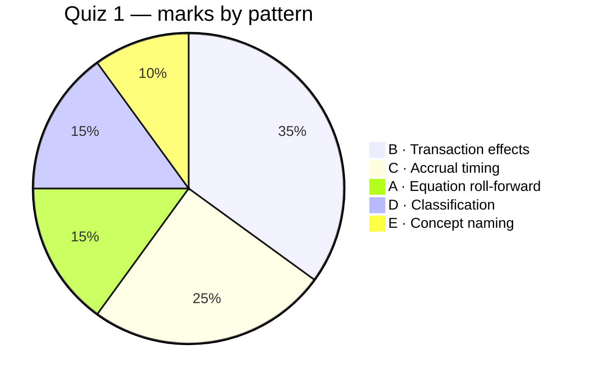

---
tags:
  - fra
  - exam-prep
  - past-paper
course: Financial Reporting & Analysis
source: FRA Quiz 1
dg-publish: false
---

# 92 · Quiz 1 — Questions + Worked Breakdown

> [!info] What this is
> The full **Quiz 1** paper (all 20 questions inline), each one **self-testable** — question and options are always visible; the worked answer stays hidden until you **click _Reveal answer_**. Every answer is **mapped to topic notes**, and the **question patterns** are extracted so you can predict what's likely to recur. Drill the same patterns in [[91-Exam-Question-Bank]].

---

## 1. Question patterns (what the paper actually tests)

Five recurring patterns account for all 20 questions. Weight your prep accordingly.

| Pattern | Questions | Weight | Study |
|---|---|---|---|
| **A · Equation roll-forward** (compute a missing figure via A = L + E and RE roll-forward) | Q1, Q13, Q19 | 3 | [[08-The-Accounting-Equation#The expanded equation]] |
| **B · Transaction / dual-aspect effect** (which accounts move, which way) | Q2, Q3, Q6, Q7, Q12, Q18, Q20 | **7** | [[08-The-Accounting-Equation#Transaction-effect analysis]] |
| **C · Accrual timing** (prepaid vs accrued; profit impact) | Q4, Q5, Q8, Q9, Q16 | 5 | [[07-Conceptual-Framework-and-Core-Concepts#Accrual Concept]] |
| **D · Classification & definitions** (asset types, revenue, characteristics) | Q10, Q11, Q17 | 3 | [[03-Balance-Sheet-Assets]] · [[05-Income-Statement-PandL]] |
| **E · Concept naming** (materiality; amortisation) | Q14, Q15 | 2 | [[07-Conceptual-Framework-and-Core-Concepts]] · [[03-Balance-Sheet-Assets#Depreciation]] |

> [!tip] The headline takeaway
> **Two-thirds of the paper is Patterns B + C** — transaction effects and accrual timing. If you can (i) analyse any transaction's effect on A = L + E, and (ii) decide whether an item hits *this* period's profit, you clear ~12 of 20 questions cold. Everything else is definitions.

---

## 2. Every question, worked and mapped

> [!question] Q1 — Total assets of ABC *(Pattern A → [[08-The-Accounting-Equation]])*
> The following information was compiled for company ABC:
> - Beginning retained earnings: ₹6,000
> - Liabilities at year-end: ₹11,000
> - Contributed capital at year-end: ₹5,000
> - Revenue for the year: ₹18,000
> - Expenses incurred: ₹15,500
> - Dividends: ₹1,500
>
> The total assets of company ABC should be closest to:
> - a. ₹23,000
> - b. ₹12,000
> - c. ₹45,000
> - d. None of the above
>> [!success]- Reveal answer
>> **d. None of the above (₹21,000).** Closing RE = 6,000 + (18,000 − 15,500) − 1,500 = **5,000**. Equity = 5,000 + 5,000 = **10,000**. Assets = 11,000 + 10,000 = **₹21,000**. None of the listed options (23,000/12,000/45,000) match → **d**. *Trap: 23,000 tempts you if you forget dividends; 45,000 if you add revenue as an asset.*

> [!question] Q2 — Paying an account payable *(Pattern B)*
> A sole proprietor recorded the payment of an account payable to a supplier's store. Recording the transaction will:
> - a. increase an asset, increase a liability
> - b. decrease an asset, decrease a liability
> - c. increase an asset, increase owner's equity
> - d. decrease an asset, decrease owner's equity
>> [!success]- Reveal answer
>> **b. decrease an asset, decrease a liability.** Cash ↓ (asset) and Payable ↓ (liability). → [[08-The-Accounting-Equation#The four ways a transaction can move the equation]]

> [!question] Q3 — A transaction affects how many accounts? *(Pattern B)*
> The accounting equation should remain in balance because every transaction affects how many accounts?
> - a. Only one
> - b. Only two
> - c. Two or more
> - d. All of given options
>> [!success]- Reveal answer
>> **c. Two or more.** Dual-aspect minimum is two; some (a credit sale with COGS) touch four. → [[07-Conceptual-Framework-and-Core-Concepts#Dual Aspect]]

> [!question] Q4 — Method reporting expenses when incurred *(Pattern C)*
> The __________ method (or basis) of accounting reports expenses when they are incurred (as opposed to when they are paid).
>> [!success]- Reveal answer
>> **Accrual (method/basis).** Records expenses when *incurred*, not when paid. → [[07-Conceptual-Framework-and-Core-Concepts#Accrual Concept]]

> [!question] Q5 — Expired prepaid rent falls under which of the five heads? *(Pattern C/D)*
> The amount of prepaid rent that has expired in the accounting period is reported under which of the five broad heads?
>> [!success]- Reveal answer
>> **Expense.** Once the benefit **expires**, prepaid rent (an asset) becomes rent **expense**. The five heads are Assets, Liabilities, Equity, Revenue, **Expenses**. → [[03-Balance-Sheet-Assets#What is an asset?]]

> [!question] Q6 — Which transaction has **no** impact on stockholders' equity? *(Pattern B)*
> Which of the following transactions would have no impact on stockholders' equity?
> - a. Purchase of machine on credit on year-end
> - b. Dividends to stockholders
> - c. Net loss
> - d. Investment in cash by stockholders
>> [!success]- Reveal answer
>> **a. Purchase of a machine on credit.** Machine ↑ (asset) and Payable ↑ (liability) — equity untouched. Dividends (b) and net loss (c) reduce equity; investment (d) raises it. → [[04-Balance-Sheet-Equity-and-Liabilities]]

> [!question] Q7 — Dual aspect of rent due to be paid *(Pattern B)*
> What is the dual aspect of rent due to be paid?
> - a. Increase in asset, decrease in liability
> - b. Increase in expense, decrease in asset
> - c. Increase in expense, increase in liability
> - d. Increase in asset, increase in liability
>> [!success]- Reveal answer
>> **c. Increase in expense, increase in liability.** Rent expense ↑ (equity ↓) and Rent payable ↑ (accrued liability). → [[09-The-Accounting-Cycle-Recording-Transactions#Adjusting entries]]

> [!question] Q8 — Advance salary for April paid on 31 Mar 2024; impact on FY2023-24 profit *(Pattern C)*
> JK Stores paid advance salary for April 2024 on 31st March 2024. What is its impact on the profit for the year 2023-24?
> - a. Increase
> - b. Decrease
> - c. No effect
>> [!success]- Reveal answer
>> **c. No effect.** A **prepaid expense (asset)** — the benefit belongs to April (next year). Cash left, but no expense this year. → [[07-Conceptual-Framework-and-Core-Concepts#Accrual Concept]]

> [!question] Q9 — March 2024 rent paid on 1 Apr 2024; impact on FY2023-24 profit *(Pattern C)*
> JK Stores paid rent for March 2024 on 1st April 2024. What is its impact on the profit for the year 2023-24?
> - a. Increase
> - b. Decrease
> - c. No effect
>> [!success]- Reveal answer
>> **b. Decrease.** March rent is a **March expense** (accrued at year-end), even though paid next year. *Contrast Q8: cash timing is irrelevant; benefit period is everything.* → [[07-Conceptual-Framework-and-Core-Concepts#Accrual Concept]]

> [!question] Q10 — Long-term assets without physical existence but with rights *(Pattern D)*
> Long-term assets without physical existence but with certain rights are?
> - a. Current assets
> - b. Fixed assets
> - c. Intangible assets
> - d. Investments
>> [!success]- Reveal answer
>> **c. Intangible assets.** Patents, copyrights, goodwill. → [[03-Balance-Sheet-Assets#Other intangible assets]]

> [!question] Q11 — Which items are revenue? *(Pattern D)*
> Which of the following items are considered as revenue for a business?
> - a. Cash purchases only
> - b. Cash sales only
> - c. Credit purchases only
> - d. Both cash sales and credit sales
>> [!success]- Reveal answer
>> **d. Both cash sales and credit sales.** Revenue is recognised when **earned**, so credit sales count too. Purchases are not revenue. → [[05-Income-Statement-PandL#Revenue vs other income]]

> [!question] Q12 — Company receives cash from a debtor; accounts affected *(Pattern B)*
> Which of the following accounts will be affected by a transaction where the company receives cash from a debtor?
> - a. Owner's equity and cash
> - b. Owner's equity and debtors
> - c. Debtors and cash
> - d. None of the above
>> [!success]- Reveal answer
>> **c. Debtors and cash.** Cash ↑, Debtors ↓ — an asset-for-asset swap; equity untouched. → [[08-The-Accounting-Equation#Transaction-effect analysis]]

> [!question] Q13 — Liabilities ₹8,00,000, capital ₹7,00,000; total assets *(Pattern A)*
> Liabilities of a firm are ₹8,00,000 and capital of the proprietor is ₹7,00,000. Then total assets are:
> - a. ₹1,00,000
> - b. ₹15,00,000
> - c. ₹4,00,000
> - d. ₹6,00,000
>> [!success]- Reveal answer
>> **b. ₹15,00,000.** A = L + E = 8,00,000 + 7,00,000. → [[08-The-Accounting-Equation#The basic equation]]

> [!question] Q14 — A pen booked as expense not asset; due to *(Pattern E)*
> Accounting of a pen as an expense and not as an asset is due to:
> - a. Materiality
> - b. Conservatism
> - c. Consistency
> - d. Disclosure
>> [!success]- Reveal answer
>> **a. Materiality.** Too small to warrant asset-tracking. Not conservatism (that's anticipating losses). → [[07-Conceptual-Framework-and-Core-Concepts#Materiality Concept]]

> [!question] Q15 — Decrease in value of intangible assets *(Pattern E)*
> Decrease in the value of intangible assets is:
> - a. Amortization
> - b. Depreciation
> - c. Depletion
> - d. None of the above
>> [!success]- Reveal answer
>> **a. Amortization.** Amortisation → intangibles; depreciation → tangibles; depletion → natural resources. → [[03-Balance-Sheet-Assets#Depreciation, amortisation & depletion]]

> [!question] Q16 — Purchased land ₹10,00,000 on 1 Apr 2023; impact on PBT *(Pattern B/C)*
> State the impact on profit before taxes (PBT) for the year ending 31st March 2024. Write increase, decrease or no impact, and indicate the amount by which the change happens: Purchased land for ₹10,00,000 on 1st April 2023.
>> [!success]- Reveal answer
>> **No impact (₹0).** Buying land is an **asset-for-asset swap** (Cash ↓ ₹10,00,000, Land ↑ ₹10,00,000) — no expense, so **PBT unchanged**. And land is **not depreciated**, so no depreciation expense either. → [[03-Balance-Sheet-Assets#Depreciation]] · [[08-The-Accounting-Equation]]

> [!question] Q17 — Common characteristic of all assets *(Pattern D)*
> What is the common characteristic of all the assets owned by a company?
> - a. Intangible
> - b. Long Life
> - c. Future Economic Benefits
> - d. None of the above
>> [!success]- Reveal answer
>> **c. Future Economic Benefits.** Not "long life" (current assets) nor "intangible" (many are tangible). → [[03-Balance-Sheet-Assets#What is an asset?]]

> [!question] Q18 — What causes a decrease in assets? *(Pattern B)*
> What causes the decrease in Assets?
> - a. Cash Purchases
> - b. Liabilities
> - c. Payment of Expenses
> - d. Retained Earnings
>> [!success]- Reveal answer
>> **c. Payment of Expenses.** Paying an expense reduces cash (and equity). Cash *purchases* swap one asset for another; liabilities and retained earnings don't reduce assets. → [[08-The-Accounting-Equation#The four ways a transaction can move the equation]]

> [!question] Q19 — Capital on 31.03.2024: opening 4,10,000; drawings 40,000; profit 50,000 *(Pattern A)*
> From the following details estimate the capital as on 31.03.2024. Capital as on 01.04.2023 is ₹4,10,000. Withdrawal by owner is ₹40,000, Profit during the year ₹50,000.
> - a. ₹4,10,000
> - b. ₹4,50,000
> - c. ₹4,20,000
> - d. ₹4,00,000
>> [!success]- Reveal answer
>> **c. ₹4,20,000.** 4,10,000 + 50,000 − 40,000 = ₹4,20,000. → [[08-The-Accounting-Equation#The expanded equation]]

> [!question] Q20 — Purchase of machinery for cash *(Pattern B)*
> Purchase of machinery for cash:
> - a. Increases total assets
> - b. Decreases total assets
> - c. Keeps total assets unchanged
> - d. Increases assets and liabilities
>> [!success]- Reveal answer
>> **c. Keeps total assets unchanged.** Machinery ↑, Cash ↓ by equal amounts — an asset swap. → [[08-The-Accounting-Equation#The four ways a transaction can move the equation]]

---

## 3. Answer key (quick reference)

> [!note]- Reveal full answer key
>
> | Q | Ans | Q | Ans | Q | Ans | Q | Ans |
> |---|---|---|---|---|---|---|---|
> | 1 | d (₹21,000) | 6 | a | 11 | d | 16 | No impact (₹0) |
> | 2 | b | 7 | c | 12 | c | 17 | c |
> | 3 | c | 8 | c | 13 | b | 18 | c |
> | 4 | Accrual | 9 | b | 14 | a | 19 | c |
> | 5 | Expense | 10 | c | 15 | a | 20 | c |

---

## 4. What to expect next time — predicted recurrences

> [!tip] High-probability question types (based on this paper)
> 1. **A missing-figure equation problem** like Q1 — expect one with the RE roll-forward. *Drill C8.1 in the bank.*
> 2. **Several "which accounts move / no-effect" items** like Q2, Q6, Q7, Q12, Q20 — the paper's biggest bucket.
> 3. **A prepaid-vs-accrued profit-impact pair** like Q8/Q9 — nearly guaranteed; know the direction cold.
> 4. **A "purchase of a non-current asset" trap** like Q16/Q20 — asset swap, no profit impact; land not depreciated.
> 5. **Definition one-liners** — asset characteristic (Q17), revenue (Q11), amortisation (Q15), materiality (Q14).

> [!warning] The three traps that cost easy marks
> - **Forgetting dividends/drawings** in the roll-forward (Q1, Q19).
> - **Letting cash timing drive expense timing** (Q8/Q9) — it's the *benefit period* that matters.
> - **Treating an asset purchase as an expense** (Q16, Q20) — it's a swap; profit is untouched.

---

**Related:** [[00-Course-Map]] · [[91-Exam-Question-Bank]] · [[90-Master-Formula-Sheet]]
