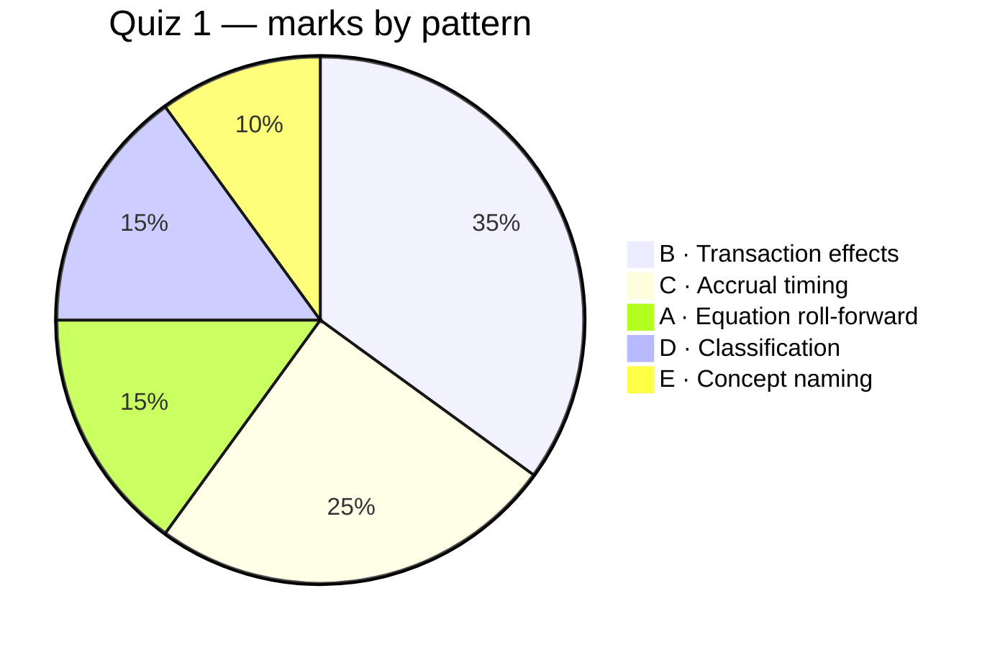

# Past Papers — Worked & Mapped

> [!info] What this is
> Every real past paper in one place: **Quiz 1** (worked question-by-question), **Quiz 2** (worked in full), and the **Quiz 3 & 4** mapping. Self-test format — question visible, answer hidden until you expand _Reveal answer_. Predicted practice lives in [[Mock Papers (Predicted)]]; the professor's own revision quiz in [[Fun Quiz (Session 14)]].

## Contents
- **Quiz 1** — full worked breakdown + question patterns (below)
- [[#2. Quiz 2 — every question, worked and mapped|Quiz 2]] — worked in full
- [[#3. Quiz 3 — mapping only (later topic)|Quiz 3]] & [[#4. Quiz 4 — mapping only (cash-flow & deferred-tax paper)|Quiz 4]] — mapped to topic notes

---

# Quiz 1 — Questions + Worked Breakdown

> [!info] What this is
> The full **Quiz 1** paper (all 20 questions inline), each one **self-testable** — question and options are always visible; the worked answer stays hidden until you **click _Reveal answer_**. Every answer is **mapped to topic notes**, and the **question patterns** are extracted so you can predict what's likely to recur. Drill the same patterns in [[91. Exam Question Bank]].

---

## 1. Question patterns (what the paper actually tests)

Five recurring patterns account for all 20 questions. Weight your prep accordingly.

| Pattern | Questions | Weight | Study |
|---|---|---|---|
| **A · Equation roll-forward** (compute a missing figure via A = L + E and RE roll-forward) | Q1, Q13, Q19 | 3 | [[08. The Accounting Equation#The expanded equation]] |
| **B · Transaction / dual-aspect effect** (which accounts move, which way) | Q2, Q3, Q6, Q7, Q12, Q18, Q20 | **7** | [[08. The Accounting Equation#Transaction-effect analysis]] |
| **C · Accrual timing** (prepaid vs accrued; profit impact) | Q4, Q5, Q8, Q9, Q16 | 5 | [[07. Conceptual Framework and Core Concepts#Accrual Concept]] |
| **D · Classification & definitions** (asset types, revenue, characteristics) | Q10, Q11, Q17 | 3 | [[03. Balance Sheet Assets]] · [[05. Income Statement PandL]] |
| **E · Concept naming** (materiality; amortisation) | Q14, Q15 | 2 | [[07. Conceptual Framework and Core Concepts]] · [[03. Balance Sheet Assets#Depreciation]] |

> [!tip] The headline takeaway
> **Two-thirds of the paper is Patterns B + C** — transaction effects and accrual timing. If you can (i) analyse any transaction's effect on A = L + E, and (ii) decide whether an item hits *this* period's profit, you clear ~12 of 20 questions cold. Everything else is definitions.

---

## 2. Every question, worked and mapped

> [!question] Q1 — Total assets of ABC *(Pattern A → [[08. The Accounting Equation]])*
> The following information was compiled for company ABC:
> - Beginning retained earnings: ₹6,000
> - Liabilities at year-end: ₹11,000
> - Contributed capital at year-end: ₹5,000
> - Revenue for the year: ₹18,000
> - Expenses incurred: ₹15,500
> - Dividends: ₹1,500
>
> The total assets of company ABC should be closest to:
> - a. ₹23,000
> - b. ₹12,000
> - c. ₹45,000
> - d. None of the above
>> [!success]- Reveal answer
>> **d. None of the above (₹21,000).** Closing RE = 6,000 + (18,000 − 15,500) − 1,500 = **5,000**. Equity = 5,000 + 5,000 = **10,000**. Assets = 11,000 + 10,000 = **₹21,000**. None of the listed options (23,000/12,000/45,000) match → **d**. *Trap: 23,000 tempts you if you forget dividends; 45,000 if you add revenue as an asset.*

> [!question] Q2 — Paying an account payable *(Pattern B)*
> A sole proprietor recorded the payment of an account payable to a supplier's store. Recording the transaction will:
> - a. increase an asset, increase a liability
> - b. decrease an asset, decrease a liability
> - c. increase an asset, increase owner's equity
> - d. decrease an asset, decrease owner's equity
>> [!success]- Reveal answer
>> **b. decrease an asset, decrease a liability.** Cash ↓ (asset) and Payable ↓ (liability). → [[08. The Accounting Equation#The four ways a transaction can move the equation]]

> [!question] Q3 — A transaction affects how many accounts? *(Pattern B)*
> The accounting equation should remain in balance because every transaction affects how many accounts?
> - a. Only one
> - b. Only two
> - c. Two or more
> - d. All of given options
>> [!success]- Reveal answer
>> **c. Two or more.** Dual-aspect minimum is two; some (a credit sale with COGS) touch four. → [[07. Conceptual Framework and Core Concepts#Dual Aspect]]

> [!question] Q4 — Method reporting expenses when incurred *(Pattern C)*
> The __________ method (or basis) of accounting reports expenses when they are incurred (as opposed to when they are paid).
>> [!success]- Reveal answer
>> **Accrual (method/basis).** Records expenses when *incurred*, not when paid. → [[07. Conceptual Framework and Core Concepts#Accrual Concept]]

> [!question] Q5 — Expired prepaid rent falls under which of the five heads? *(Pattern C/D)*
> The amount of prepaid rent that has expired in the accounting period is reported under which of the five broad heads?
>> [!success]- Reveal answer
>> **Expense.** Once the benefit **expires**, prepaid rent (an asset) becomes rent **expense**. The five heads are Assets, Liabilities, Equity, Revenue, **Expenses**. → [[03. Balance Sheet Assets#What is an asset?]]

> [!question] Q6 — Which transaction has **no** impact on stockholders' equity? *(Pattern B)*
> Which of the following transactions would have no impact on stockholders' equity?
> - a. Purchase of machine on credit on year-end
> - b. Dividends to stockholders
> - c. Net loss
> - d. Investment in cash by stockholders
>> [!success]- Reveal answer
>> **a. Purchase of a machine on credit.** Machine ↑ (asset) and Payable ↑ (liability) — equity untouched. Dividends (b) and net loss (c) reduce equity; investment (d) raises it. → [[04. Balance Sheet Equity and Liabilities]]

> [!question] Q7 — Dual aspect of rent due to be paid *(Pattern B)*
> What is the dual aspect of rent due to be paid?
> - a. Increase in asset, decrease in liability
> - b. Increase in expense, decrease in asset
> - c. Increase in expense, increase in liability
> - d. Increase in asset, increase in liability
>> [!success]- Reveal answer
>> **c. Increase in expense, increase in liability.** Rent expense ↑ (equity ↓) and Rent payable ↑ (accrued liability). → [[09. The Accounting Cycle Recording Transactions#Adjusting entries]]

> [!question] Q8 — Advance salary for April paid on 31 Mar 2024; impact on FY2023-24 profit *(Pattern C)*
> JK Stores paid advance salary for April 2024 on 31st March 2024. What is its impact on the profit for the year 2023-24?
> - a. Increase
> - b. Decrease
> - c. No effect
>> [!success]- Reveal answer
>> **c. No effect.** A **prepaid expense (asset)** — the benefit belongs to April (next year). Cash left, but no expense this year. → [[07. Conceptual Framework and Core Concepts#Accrual Concept]]

> [!question] Q9 — March 2024 rent paid on 1 Apr 2024; impact on FY2023-24 profit *(Pattern C)*
> JK Stores paid rent for March 2024 on 1st April 2024. What is its impact on the profit for the year 2023-24?
> - a. Increase
> - b. Decrease
> - c. No effect
>> [!success]- Reveal answer
>> **b. Decrease.** March rent is a **March expense** (accrued at year-end), even though paid next year. *Contrast Q8: cash timing is irrelevant; benefit period is everything.* → [[07. Conceptual Framework and Core Concepts#Accrual Concept]]

> [!question] Q10 — Long-term assets without physical existence but with rights *(Pattern D)*
> Long-term assets without physical existence but with certain rights are?
> - a. Current assets
> - b. Fixed assets
> - c. Intangible assets
> - d. Investments
>> [!success]- Reveal answer
>> **c. Intangible assets.** Patents, copyrights, goodwill. → [[03. Balance Sheet Assets#Other intangible assets]]

> [!question] Q11 — Which items are revenue? *(Pattern D)*
> Which of the following items are considered as revenue for a business?
> - a. Cash purchases only
> - b. Cash sales only
> - c. Credit purchases only
> - d. Both cash sales and credit sales
>> [!success]- Reveal answer
>> **d. Both cash sales and credit sales.** Revenue is recognised when **earned**, so credit sales count too. Purchases are not revenue. → [[05. Income Statement PandL#Revenue vs other income]]

> [!question] Q12 — Company receives cash from a debtor; accounts affected *(Pattern B)*
> Which of the following accounts will be affected by a transaction where the company receives cash from a debtor?
> - a. Owner's equity and cash
> - b. Owner's equity and debtors
> - c. Debtors and cash
> - d. None of the above
>> [!success]- Reveal answer
>> **c. Debtors and cash.** Cash ↑, Debtors ↓ — an asset-for-asset swap; equity untouched. → [[08. The Accounting Equation#Transaction-effect analysis]]

> [!question] Q13 — Liabilities ₹8,00,000, capital ₹7,00,000; total assets *(Pattern A)*
> Liabilities of a firm are ₹8,00,000 and capital of the proprietor is ₹7,00,000. Then total assets are:
> - a. ₹1,00,000
> - b. ₹15,00,000
> - c. ₹4,00,000
> - d. ₹6,00,000
>> [!success]- Reveal answer
>> **b. ₹15,00,000.** A = L + E = 8,00,000 + 7,00,000. → [[08. The Accounting Equation#The basic equation]]

> [!question] Q14 — A pen booked as expense not asset; due to *(Pattern E)*
> Accounting of a pen as an expense and not as an asset is due to:
> - a. Materiality
> - b. Conservatism
> - c. Consistency
> - d. Disclosure
>> [!success]- Reveal answer
>> **a. Materiality.** Too small to warrant asset-tracking. Not conservatism (that's anticipating losses). → [[07. Conceptual Framework and Core Concepts#Materiality Concept]]

> [!question] Q15 — Decrease in value of intangible assets *(Pattern E)*
> Decrease in the value of intangible assets is:
> - a. Amortization
> - b. Depreciation
> - c. Depletion
> - d. None of the above
>> [!success]- Reveal answer
>> **a. Amortization.** Amortisation → intangibles; depreciation → tangibles; depletion → natural resources. → [[03. Balance Sheet Assets#Depreciation, amortisation & depletion]]

> [!question] Q16 — Purchased land ₹10,00,000 on 1 Apr 2023; impact on PBT *(Pattern B/C)*
> State the impact on profit before taxes (PBT) for the year ending 31st March 2024. Write increase, decrease or no impact, and indicate the amount by which the change happens: Purchased land for ₹10,00,000 on 1st April 2023.
>> [!success]- Reveal answer
>> **No impact (₹0).** Buying land is an **asset-for-asset swap** (Cash ↓ ₹10,00,000, Land ↑ ₹10,00,000) — no expense, so **PBT unchanged**. And land is **not depreciated**, so no depreciation expense either. → [[03. Balance Sheet Assets#Depreciation]] · [[08. The Accounting Equation]]

> [!question] Q17 — Common characteristic of all assets *(Pattern D)*
> What is the common characteristic of all the assets owned by a company?
> - a. Intangible
> - b. Long Life
> - c. Future Economic Benefits
> - d. None of the above
>> [!success]- Reveal answer
>> **c. Future Economic Benefits.** Not "long life" (current assets) nor "intangible" (many are tangible). → [[03. Balance Sheet Assets#What is an asset?]]

> [!question] Q18 — What causes a decrease in assets? *(Pattern B)*
> What causes the decrease in Assets?
> - a. Cash Purchases
> - b. Liabilities
> - c. Payment of Expenses
> - d. Retained Earnings
>> [!success]- Reveal answer
>> **c. Payment of Expenses.** Paying an expense reduces cash (and equity). Cash *purchases* swap one asset for another; liabilities and retained earnings don't reduce assets. → [[08. The Accounting Equation#The four ways a transaction can move the equation]]

> [!question] Q19 — Capital on 31.03.2024: opening 4,10,000; drawings 40,000; profit 50,000 *(Pattern A)*
> From the following details estimate the capital as on 31.03.2024. Capital as on 01.04.2023 is ₹4,10,000. Withdrawal by owner is ₹40,000, Profit during the year ₹50,000.
> - a. ₹4,10,000
> - b. ₹4,50,000
> - c. ₹4,20,000
> - d. ₹4,00,000
>> [!success]- Reveal answer
>> **c. ₹4,20,000.** 4,10,000 + 50,000 − 40,000 = ₹4,20,000. → [[08. The Accounting Equation#The expanded equation]]

> [!question] Q20 — Purchase of machinery for cash *(Pattern B)*
> Purchase of machinery for cash:
> - a. Increases total assets
> - b. Decreases total assets
> - c. Keeps total assets unchanged
> - d. Increases assets and liabilities
>> [!success]- Reveal answer
>> **c. Keeps total assets unchanged.** Machinery ↑, Cash ↓ by equal amounts — an asset swap. → [[08. The Accounting Equation#The four ways a transaction can move the equation]]

---

## 3. Answer key (quick reference)

> [!note]- Reveal full answer key
>
> | Q | Ans | Q | Ans | Q | Ans | Q | Ans |
> |---|---|---|---|---|---|---|---|
> | 1 | d (₹21,000) | 6 | a | 11 | d | 16 | No impact (₹0) |
> | 2 | b | 7 | c | 12 | c | 17 | c |
> | 3 | c | 8 | c | 13 | b | 18 | c |
> | 4 | Accrual | 9 | b | 14 | a | 19 | c |
> | 5 | Expense | 10 | c | 15 | a | 20 | c |

---

## 4. What to expect next time — predicted recurrences

> [!tip] High-probability question types (based on this paper)
> 1. **A missing-figure equation problem** like Q1 — expect one with the RE roll-forward. *Drill C8.1 in the bank.*
> 2. **Several "which accounts move / no-effect" items** like Q2, Q6, Q7, Q12, Q20 — the paper's biggest bucket.
> 3. **A prepaid-vs-accrued profit-impact pair** like Q8/Q9 — nearly guaranteed; know the direction cold.
> 4. **A "purchase of a non-current asset" trap** like Q16/Q20 — asset swap, no profit impact; land not depreciated.
> 5. **Definition one-liners** — asset characteristic (Q17), revenue (Q11), amortisation (Q15), materiality (Q14).

> [!warning] The three traps that cost easy marks
> - **Forgetting dividends/drawings** in the roll-forward (Q1, Q19).
> - **Letting cash timing drive expense timing** (Q8/Q9) — it's the *benefit period* that matters.
> - **Treating an asset purchase as an expense** (Q16, Q20) — it's a swap; profit is untouched.

---

**Related:** [[00. Course Map]] · [[91. Exam Question Bank]] · [[90. Master Formula Sheet]]

---

# Quizzes 2, 3 & 4 — Review & Relevance

> [!info] What this is
> A relevance-sorted review of three past papers. **Quiz 2 (2015) is the paper that maps to Sessions 5–6** (debit/credit balances, adjusting-entry effects, unearned revenue, the accounting-equation roll-forward) — it is **broken down in full** below. **Quiz 3** (depreciation methods, revaluation, impairment, inventory valuation) and **Quiz 4** (cash flow + deferred tax) test **later topics**; they are **mapped, not fully worked**, so you know where each question will land once those notes exist. Same reveal-to-check format as [[Past Papers (Worked)|Quiz 1]].

---

## 1. Relevance verdict

| Paper | Tests | Maps to | Relevant to Sessions 5–6? |
|---|---|---|---|
| **Quiz 2** | Debit/credit balances, adjusting-entry effects, unearned revenue, provision for doubtful debts, equation roll-forward | [[10. Journal Ledger and Trial Balance]], [[11. Adjusting Entries and Final Accounts]], [[08. The Accounting Equation]] | **Yes — directly.** Work this one now. |
| **Quiz 3** | Change in depreciation method (WDV↔SLM), revaluation model & reserve, impairment, LIFO/FIFO inventory valuation | [[03. Balance Sheet Assets]] (a future *fixed-assets & inventory-valuation* note) | **Mostly no** — later topic. Only the *accumulated-depreciation* and *perpetual/periodic* foundations ([[11. Adjusting Entries and Final Accounts#6. Depreciation via accumulated depreciation (Day 8)|§6]]/[[11. Adjusting Entries and Final Accounts#7. Recording inventory — perpetual vs periodic (Day 8)|§7]]) connect. |
| **Quiz 4** | Cash-flow classification & indirect method, cash-to-accrual, deferred tax | [[06. Cash Flow Statement]] (+ a future *deferred-tax* note) | **Mostly no** — cash-flow paper. Three items (cash-to-accrual, capex effect, dividends) touch Sessions 5–6. |

> [!tip] Bottom line
> **Drill Quiz 2 cold now.** Skim Quiz 3 and Quiz 4 to see the *shape* of later papers, but don't sink time into their computations until fixed-assets/inventory-valuation, cash flow and deferred tax are covered.

---

## 2. Quiz 2 — every question, worked and mapped

*Max 20 marks · 25 minutes · 2015.*

> [!question] Q1 — Fill in **debit** or **credit** balance *(→ [[10. Journal Ledger and Trial Balance]])* (4)
> Each account "will always have a ____ balance":
> a. Building   b. Outstanding wages   c. Unearned revenue   d. Prepaid insurance
>> [!success]- Reveal answer
>> a. **Debit** (Building — an asset). b. **Credit** (Outstanding wages — a liability). c. **Credit** (Unearned revenue — a liability). d. **Debit** (Prepaid insurance — an asset). Rule: assets & expenses = debit balances; liabilities, equity, revenue = credit balances. → [[10. Journal Ledger and Trial Balance#1. The rule that governs everything]]

> [!question] Q2 — Provision for doubtful debts, **allowance method** *(→ [[11. Adjusting Entries and Final Accounts]] · receivables)* (5+1+1+2)
> On March 1, Mega Co. had Trade receivables ₹4,78,900 and Provision for doubtful debts ₹12,710. During the month:
> i. Sales on account ₹3,28,000  ii. Sales returns on credit sales ₹4,300  iii. Collections ₹3,72,900  iv. Accounts written off ₹9,720  v. Previously written-off account recovered ₹1,870.
> (a) Journalise each. (b) Provision balance at month-end? (c) Provision to maintain at 2% of net credit sales? (d) Entry to bring provision to that level.
>> [!success]- Reveal answer
>> **(a) Journal entries:**
>> i. `Trade receivables Dr 3,28,000 / To Sales 3,28,000`
>> ii. `Sales returns Dr 4,300 / To Trade receivables 4,300` *(a credit-sales return reduces the receivable — **not** cash; the exam script's "Cash Dr" is wrong here)*
>> iii. `Cash Dr 3,72,900 / To Trade receivables 3,72,900`
>> iv. `Allowance for doubtful debts Dr 9,720 / To Trade receivables 9,720` *(allowance method → write-off hits the allowance, not expense)*
>> v. Two steps: `Trade receivables Dr 1,870 / To Allowance 1,870` (reinstate), then `Cash Dr 1,870 / To Trade receivables 1,870` (collect) — net effect: Cash ↑, Allowance ↑.
>>
>> **(b) Provision balance** = 12,710 − 9,720 (write-off) + 1,870 (recovery reinstated) = **₹4,860**.
>>
>> **(c) Desired provision** = 2% × net credit sales = 2% × (3,28,000 − 4,300) = 2% × 3,23,700 = **₹6,474**.
>>
>> **(d) Top-up entry** = 6,474 − 4,860 = ₹1,614: `Doubtful-debts expense Dr 1,614 / To Allowance for doubtful debts 1,614`.
>>
>> → [[11. Adjusting Entries and Final Accounts#1. Why adjusting entries exist]]

> [!warning] Q2 — flag the "net credit sales" base
> The answer above deducts sales returns (net credit sales ₹3,23,700 → provision ₹6,474 → top-up ₹1,614). If your instructor takes the base as **gross** credit sales ₹3,28,000, desired provision = ₹6,560 and the top-up = ₹1,700. The marked script appears to use a still different base (≈ closing receivables). **Confirm which base is intended** — the *method* (top-up from ₹4,860 to the desired balance) is what earns the marks.

> [!question] Q3 — Rent paid for the last month was **not recorded**; effect on the statements *(→ [[11. Adjusting Entries and Final Accounts]])* (1)
> a. Understated assets and liabilities  b. Overstated assets and shareholders' equity  c. Understated liabilities and overstated equity  d. Overstated assets and understated equity
>> [!success]- Reveal answer
>> **b. Overstated assets and shareholders' equity.** The cash payment wasn't recorded → **cash (asset) overstated**; the rent expense wasn't recorded → profit (and hence **equity) overstated**. → [[11. Adjusting Entries and Final Accounts#5. Closing entries (Day 8)]]

> [!question] Q4 — Salary of ₹7,00,000 wrongly booked as **prepaid salary**; effect on net income *(→ [[11. Adjusting Entries and Final Accounts]])* (1)
> a. Net income overstated by ₹7,00,000  b. Understated by ₹7,00,000  c. No effect  d. None
>> [!success]- Reveal answer
>> **a. Overstated by ₹7,00,000.** Recording the payment as a **prepaid asset** instead of a **salary expense** leaves the expense out of the P&L, so profit is too high by the full ₹7,00,000. → [[11. Adjusting Entries and Final Accounts#1. Why adjusting entries exist]]

> [!question] Q5 — Receipt from customers as **advance payment** is classified as *(→ [[11. Adjusting Entries and Final Accounts]])* (1)
> a. Accrued asset  b. Unearned revenue  c. Prepaid expense  d. Asset
>> [!success]- Reveal answer
>> **b. Unearned revenue** — cash received before the service is delivered is a **liability** until earned. → [[11. Adjusting Entries and Final Accounts#1. Why adjusting entries exist]]

> [!question] Q6 — Fill the blanks in the two-year table *(→ [[08. The Accounting Equation]] · [[11. Adjusting Entries and Final Accounts#9. Statement of changes in equity|SCE]])* (4)
> Company started 1 Apr 2013; dividends begin the second year, so Year-2 liabilities include **dividends payable ₹100 mn**. (Rs mn)
>
> | | 31 Mar 2014 | 31 Mar 2015 |
> |---|---:|---:|
> | Assets | 2,000 | ? |
> | Liabilities | ? | 1,000 |
> | Contributed capital | 300 | 300 |
> | Retained earnings | ? | ? |
> | Cash sales | 500 | 1,500 |
> | Credit sales | 100 | 1,000 |
> | Expenses | 200 | 1,500 |
>> [!success]- Reveal answer
>> **Year 1 (2014):** RE = revenue − expenses = (500 + 100) − 200 = **₹400**. Liabilities = A − CC − RE = 2,000 − 300 − 400 = **₹1,300**.
>> **Year 2 (2015):** Profit = (1,500 + 1,000) − 1,500 = **1,000**. RE = opening 400 + 1,000 − **100 dividends** = **₹1,300**. Assets = L + CC + RE = 1,000 + 300 + 1,300 = **₹2,600**.
>>
>> | | 2014 | 2015 |
>> |---|---:|---:|
>> | Assets | 2,000 | **2,600** |
>> | Liabilities | **1,300** | 1,000 |
>> | Retained earnings | **400** | **1,300** |
>>
>> The dividend sits in liabilities (payable) *and* reduces retained earnings — the [[11. Adjusting Entries and Final Accounts#9. Statement of changes in equity|roll-forward]] in action. → [[08. The Accounting Equation#2. The expanded equation — bringing in revenue and expenses]]

> [!note]- Quiz 2 — answer key
> | Q | Answer |
> |---|---|
> | 1 | Debit / Credit / Credit / Debit |
> | 2 | Prov. balance ₹4,860; desired ₹6,474; top-up entry ₹1,614 |
> | 3 | b (overstated assets & equity) |
> | 4 | a (overstated ₹7,00,000) |
> | 5 | b (unearned revenue) |
> | 6 | 2014: Liab 1,300, RE 400 · 2015: Assets 2,600, RE 1,300 |

---

## 3. Quiz 3 — mapping only (later topic)

> [!info] Verdict — now covered
> Quiz 3 is the **fixed-assets & depreciation-methods** paper. The techniques are now written up in topic notes **13–18**. **Note:** the 2015 paper included two **LIFO/FIFO inventory** questions (Q5–Q6), but **inventory valuation was NOT taught in your Sessions 11–14** — treat those two as out of scope unless the professor says otherwise. Upload the actual 2015 paper for a full `95`-style worked breakdown.

| Q | Tests | Now lives in |
|---|---|---|
| 1 | Change in depreciation method **WDV ↔ SLM**; WDV rate; prospective effect | [[14. Depreciation Methods and Changes]] |
| 2 | **Revaluation model**: depreciation on revalued amount; RR → general-reserve transfer | [[16. Revaluation of Fixed Assets]] |
| 3 | Revaluation + depreciation + **disposal**; transfer to general reserve on disposal | [[16. Revaluation of Fixed Assets#5. Revaluation + disposal (Fun Quiz Q5 pattern)]] |
| 4 | **Impairment**: recoverable amount = higher of value-in-use & net selling price; entry when a reserve exists | [[17. Impairment of Assets]] |
| 5 | Inventory costing giving lowest income in deflation (LIFO/FIFO) | ⚠️ **out of scope** — not taught in S11–14 |
| 6 | LIFO vs FIFO COGS/income/closing-stock computation | ⚠️ **out of scope** — not taught in S11–14 |

> [!tip] The connection worth noting
> Q4's impairment entry (`Dr Impairment loss / Cr Asset`, or `Dr Revaluation reserve` first if one exists) is the same **contra logic** as depreciation in [[11. Adjusting Entries and Final Accounts#6. Depreciation via accumulated depreciation (Day 8)|§6]]. Fully worked: [[17. Impairment of Assets]]. Drill the whole block via [[Fun Quiz (Session 14)]] and [[Mock Papers (Predicted)]].

---

## 4. Quiz 4 — mapping only (cash-flow & deferred-tax paper)

> [!info] Verdict
> Quiz 4 is the **cash-flow statement + deferred-tax** paper → [[06. Cash Flow Statement]] and a future deferred-tax note. Three items brush against Sessions 5–6 and are answered below; the rest are cash-flow/tax mechanics.

| Q | Tests | Maps to |
|---|---|---|
| 1 | CFO (indirect): NI + amortisation ± ΔWC | [[06. Cash Flow Statement]] |
| 2, 4, 13 | Classifying items as **investing** | [[06. Cash Flow Statement]] |
| 3 | **Financing** activities (debentures, loans, dividends) | [[06. Cash Flow Statement]] |
| **5** | **Cash-to-accrual**: cash collected from customers | ↔ Sessions 5–6 (receivables) |
| 6, 12 | Gain on PPE sale add-back; CFO computation | [[06. Cash Flow Statement]] |
| **7** | **Capital expenditure** — immediate effect on cash vs profit | ↔ [[11. Adjusting Entries and Final Accounts#8. Capital vs revenue expenditure — repairs vs renovation (Day 8)|§8]] |
| 8, 9 | Operating loss yet cash rises; credit-terms change → CFO | [[06. Cash Flow Statement]] |
| **11** | Item that **reduces cash but not profit** | ↔ dividends (a distribution) |
| 10, 14 | Cash outflow for taxes; amortisation add-back reasoning | [[06. Cash Flow Statement]] |
| 15, 16, 17 | **Deferred tax**: taxes payable, tax expense = payable + ΔDTL − ΔDTA | Future deferred-tax note |

> [!success]- The three crossover answers
> - **Q5:** Cash collected = Sales + decrease in receivables = 2,00,000 + (40,000 − 35,000) = **$2,05,000** → option (d).
> - **Q7:** Capital expenditure's *immediate* effect → **profit: none; cash: decrease** → option (iii). (It's capitalised, not expensed — the [[11. Adjusting Entries and Final Accounts#8. Capital vs revenue expenditure — repairs vs renovation (Day 8)|capital-vs-revenue]] distinction.)
> - **Q11:** The item that reduces **cash but not profit** is **dividends paid** → option (iv). (A distribution of profit, never a P&L expense — same point as [[11. Adjusting Entries and Final Accounts#5. Closing entries (Day 8)|closing entries]].)

---

## 5. What Quiz 2 tells you to expect (Sessions 5–6)

> [!tip] High-probability question types
> 1. **"Debit or credit balance" fill-ins** (Q1) — know every account's normal balance cold.
> 2. **Adjusting-entry *effect* questions** (Q3, Q4, Q5) — an omitted or mis-booked accrual/prepayment and its effect on profit/assets/equity. The single biggest bucket.
> 3. **Unearned vs accrued** classification (Q5) — advance received = liability; earned-not-billed = asset.
> 4. **A missing-figure table** across periods (Q6) — the retained-earnings roll-forward with dividends.
> 5. **A receivables/provision problem** (Q2) — allowance-method journal entries and topping the provision to a target.

> [!warning] Traps that cost marks
> - **Mis-booking a credit-sales return as cash** (Q2 ii) — no cash moves; credit the receivable.
> - **Writing off against expense instead of the allowance** (Q2 iv) — under the allowance method the write-off hits the *provision*.
> - **Forgetting that a prepayment mis-booking leaves the expense out** (Q4) → profit overstated by the full amount.
> - **Dropping the dividend from the roll-forward** (Q6) — it reduces retained earnings *and* sits in liabilities as payable.

---

**Related:** [[Past Papers (Worked)]] · [[91. Exam Question Bank]] · [[90. Master Formula Sheet]] · [[10. Journal Ledger and Trial Balance]] · [[11. Adjusting Entries and Final Accounts]] · [[00. Course Map]]
