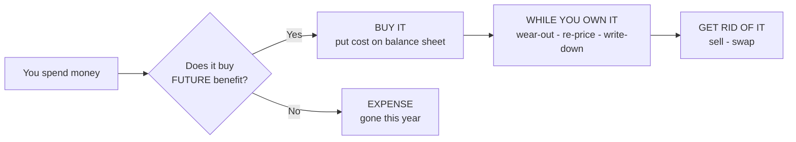

← [[20-Agent-Principal-and-the-Microsoft-Case|Agent vs Principal & Microsoft]] | [[00-Course-Map|FRA Index]] | [[FRA Session 12]] →

> [!note] Canonical worked note
> This is the full **Stafford Press** narrative. The exam-compressed version — rules, traps, and Fun-Quiz drills — is [[13-Long-Term-Assets-Acquisition-Disposal-Exchange]]. See also [[14-Depreciation-Methods-and-Changes]] · [[16-Revaluation-of-Fixed-Assets]] · [[17-Impairment-of-Assets]] · [[18-Intangible-Assets]].

## Long-Term Assets

> [!abstract] The whole topic in one idea
> A long-term asset is money you've spent that keeps paying you back for years — a press, a building, land. The accounting question is always the same: **when you spend money on it, do you park that money on the balance sheet as an asset, or do you burn it straight through the income statement as an expense?**
>
> Park it (**capitalise**) if it buys you *future* usefulness. Burn it (**expense**) if it only keeps today's asset ticking over.
>
> We learn this through one story — **Stafford Press** moving its factory — which happens to trigger all seven things that can happen to an asset over its life.
>
> **The seven:** 1. Buy it → 2. Sell it → 3. Swap it → 4. Wear it out → 5. Re-price it up → 6. Write it down → 7. The invisible kind.

---
### 0. The One Mental Model

An asset has a life. Money moves at three moments, and that's all this topic is:



> [!note] The test you'll use fifty times
> Capitalise a cost only if **(a)** it'll probably earn you money in future years, and **(b)** you can measure it reliably. That's it. Everything technical below is just this sentence applied to messier and messier facts. *(This is Ind AS 16, para 7 — the recognition test.)*

**Three words, so we mean the same thing every time:**

| Word | Plain meaning |
|---|---|
| **Cost** | What you actually gave up to get it — cash, or the value of whatever you handed over |
| **Carrying amount** | What it's worth *on the books* right now = cost minus wear-and-tear charged so far minus any write-downs. Also called "book value" or "net book value (NBV)" |
| **Recoverable amount** | What you could realistically *get back* from it — either by selling it or by using it. The number that matters when you check whether it's gone bad |

---

### The Running Case — Stafford Press

> [!info] Situation
> Stafford Press, a printing business, moved its whole plant from an old site to a new one. Everything below happened during the move. The balance sheet **just before the move** is at the end of this section.

#### Transaction Notes

**1.** The old site — land plus the building on it — was sold for **$149,860 cash**.

**2.** Some equipment was sold for **$35,200 cash**. On the books it showed cost **$73,645** minus accumulated depreciation **$40,890** = net book value **$32,755**.

**3.** A new printing press was bought. Invoice price **$112,110**. Stafford took a **2% cash discount**, so paid only **$109,868**. It also paid **$450** to a trucker for delivery. Stafford's own employees installed it — **60 hours** of work. They earn **$15/hour** in wages, but their time is normally billed to printing jobs at **$30.50/hour** (the gap being an overhead allowance of **$12.15** and profit of **$3.35**).

**4.** Stafford paid **$140,000** for land to build the new plant on. A rundown building stood on it, which the appraiser said was **worth nothing**. Stafford paid **$21,235** to tear it down, and **$13,950** for **permanent drainage**.

**5.** A new composing machine, invoice **$28,030**, was bought. Stafford paid **$20,830 cash** and got a **$7,200 trade-in allowance** on a used machine. That used machine could actually have been sold for **no more than $6,050**. It originally cost **$12,000**, had accumulated depreciation of **$5,200**, so its book value was **$6,800**.

**6.** Stafford built a new building for **$561,000** — **$136,000** cash and **$425,000** on a mortgage.

**7.** Trucking and other costs of moving equipment to the new site and reinstalling it came to **$8,440**. Plus Stafford employees spent an estimated **125 hours** on the equipment part of the move.

**8.** During the move, a piece of equipment (original cost **$10,000**) was dropped and damaged. Repairs cost **$3,220**. Management also decided its salvage value had fallen by **$660**, from **$1,950** to **$1,290**. It had been depreciated at **$805/year** — a **10% rate** after knocking off the $1,950 salvage. Accumulated depreciation so far was **$3,220**.

#### Balance Sheet Just Before the Move

| ASSETS | | | LIABILITIES AND OWNER'S EQUITY | |
|---|---:|---:|---|---:|
| **Current Assets:** | | | **Current Liabilities** | $160,223 |
| Cash | $395,868 | | **Common Stock** | $400,000 |
| Other current assets | $251,790 | | **Retained Earnings** | $358,648 |
| Total Current Assets | | $647,658 | | |
| **Property and Equipment:** | | | | |
| Land | | $34,034 | | |
| Buildings | $350,064 | | | |
| Less: Accumulated Depreciation | $199,056 | $151,008 | | |
| Equipment | $265,093 | | | |
| Less: Accumulated Depreciation | $178,922 | $86,171 | | |
| **Total** | | **$918,871** | **Total** | **$918,871** |

> [!tip] Two things to notice before you start
> 1. **The whole Land and Buildings balance belongs to the old site.** So when Stafford sells it in Transaction 1, *all* of it leaves the books. That's why, at the end, there's no old accumulated depreciation left on Buildings.
> 2. **Watch the cash.** Every transaction touches it. The cash roll-forward in §8 is really just a check that you caught every inflow and outflow.

#### Where each transaction lives

| # | What happened | Type | Section |
|---|---|---|---|
| 1 | Old site sold | Sell | §2 |
| 2 | Equipment sold | Sell | §2 |
| 3 | New press bought | Buy | §1.3 |
| 4 | Land + demolition + drainage | Buy (land) | §1.4 |
| 5 | Composing machine trade-in | Swap | §3 |
| 6 | New building built | Buy (self-built) | §1.5 |
| 7 | Moving the equipment | Expense (a trap) | §1.6 |
| 8 | Damaged equipment | Wear-out estimate + write-down check | §4, §6 |

---

### Acquisition

#### 1.1 The intuition

When you buy an asset, it’s cost is **everything you had to spend to get it in working condition**. If the machine can't earn you money sitting in the crate on the loading dock, then delivery and installation are as essential as the machine itself.

However anything you spend *after* the asset is **ready to use** is an expense.

> [!note] The rule, stated properly
> Cost = purchase price (after any discount) **plus** everything needed to get the asset to the place and condition where it can operate the way you intend. *(Ind AS 16, paras 16–17.)* Once it's ready, capitalising stops *(para 20)*.

#### 1.2 What you always leave out

Three things feel like they belong in cost but don't:

- **General overheads and admin.** The rent on head office doesn't become part of a machine just because you bought the machine that month.
- **Your own profit margin.** If your staff build something for you, you record what it *cost you* (their wages), not what you'd have *charged a customer*. Otherwise you'd be booking a profit for working on your own stuff which is inventing money.
- **Opportunity cost.** If your staff installing the press means they *couldn't* do a paying job, that lost income is real but it never appears in the accounts. 

#### 1.3 Case — buying the press (Transaction 3)

Build the cost up piece by piece:

| Piece | Amount | In or out? |
|---|---:|---|
| Invoice price | 112,110 | |
| Less 2% discount taken | (2,242) | The discount **lowers the cost** — it's not income |
| = What you actually paid | **109,868** | in |
| Delivery (trucker) | **450** | in — needed to get it there |
| Installation wages (60 hrs × $15) | **900** | in — needed to make it work, but only the *wages* |
| Overhead slice (60 × $12.15) | — | out — general overhead |
| Profit slice (60 × $3.35) | — | out — can't profit off yourself |
| **Cost of the press** | **111,218** | |

```
Dr  Equipment — Printing Press              111,218
        Cr  Cash                                     110,318   (109,868 + 450)
        Cr  Wages Payable                                900
```

> [!warning] The three classic slip-ups
> - Treating the $2,242 discount as *income*. It just makes the asset cheaper.
> - Using the $30.50 billing rate for installation. You value your labour at **cost ($15)**, not at what you'd charge a client.
> - Trying to record the revenue Stafford "lost" by not doing paying jobs. That never gets an entry.

#### 1.4 Case — buying the land (Transaction 4)

Same logic: land's cost is whatever it takes to make the plot **usable**.

| Piece | Amount | Why it's in |
|---|---:|---|
| Purchase price | 140,000 | Obvious |
| Tearing down the worthless building | 21,235 | Clearing the site is part of preparing the land |
| Permanent drainage | 13,950 | A permanent improvement to the land itself |
| **Cost of land** | **175,185** | |

```
Dr  Land                                    175,185
        Cr  Cash                                     175,185
```

> [!note] Two ideas hiding in here
> - **The building was worth nothing**, so knocking it down is just site-clearing → part of the land's cost. *If* it had been worth something, demolishing it would've been a loss instead.
> - **Land doesn't wear out**, so we never depreciate it. The word *"permanent"* on the drainage is deliberate — a permanent improvement joins the land. A drainage system with a limited life would be a separate item that *does* get depreciated.

#### 1.5 Case — building the building (Transaction 6)

Straightforward — cash plus a loan:

```
Dr  Buildings                               561,000
        Cr  Cash                                     136,000
        Cr  Mortgage Payable                         425,000
```

> [!info] The bit that isn't in the numbers — but matters
> When you *borrow to build* something that takes a long time, the **interest during construction** gets added to the building's cost, not expensed — because that interest is genuinely a cost of getting the building ready. This is required, not optional *(Ind AS 23)*. Stafford gives no interest figure, so nothing's added here, but say it in an exam.
>
> Also: a $561,000 building isn't really one thing. The lift, the roof, the HVAC all wear out at different speeds, so we split it into parts and depreciate each on its own clock. *(Ind AS 16, para 43 — "component accounting.")*

#### 1.6 Case — moving the equipment (Transaction 7): the trap

> [!example] The tempting-but-wrong move
> The $8,440 moving cost *feels* like it should be capitalised — after all, you couldn't use the equipment at the new site without moving it. So why isn't it part of the asset?

Because the equipment was **already working**. Moving it doesn't make it *more* useful than it was at the old site — it just puts it back to where it started, at a new address. You're not buying future benefit, you're restoring the status quo. So it's an **expense**.

```
Dr  Relocation Expense                        8,440
        Cr  Cash                                       8,440
```

The 125 hours of staff time stays buried in ordinary wages — no special treatment.

> [!tip] The whole idea in one comparison
> | | Installing the *new* press (T3) | Moving the *old* equipment (T7) |
> |---|---|---|
> | Was the asset already working? | No — brand new | Yes — already in use |
> | So is this buying future benefit? | Yes | No, just restoring it |
> | Verdict | **Capitalise** | **Expense** |
>
> Same physical activity — bolting a machine to a floor. Opposite answer. The only thing that changed is whether the asset was *already ready to work*. *(Ind AS 16 nails this shut in para 19 — it names "relocation costs" as something you must expense.)*

---

### 2. Disposal

### 2.1 The intuition

When you sell an asset, wipe it off the books — both its original cost **and** all the depreciation piled up against it. Compare the cash you got to what it was *worth on the books* (its net book value). Got more? **Gain.** Got less? **Loss.**

$$\text{Gain or Loss} = \text{Cash received} - \text{Net book value}$$

That gain or loss goes through the income statement — but it's **not** "revenue." Selling a machine isn't your business; printing is. *(Ind AS 16, para 68.)*

### 2.2 Case — two sales, opposite results

**Transaction 1 — old site, sold for $149,860.** The whole old-site land and building leave the books:

| | Cost | Accum. dep. | Book value |
|---|---:|---:|---:|
| Land | 34,034 | — | 34,034 |
| Building | 350,064 | 199,056 | 151,008 |
| **Total** | | | **185,042** |

Got $149,860 for something worth $185,042 → **loss of $35,182**.

```
Dr  Cash                                    149,860
Dr  Accumulated Depreciation — Buildings    199,056
Dr  Loss on Sale                             35,182
        Cr  Land                                       34,034
        Cr  Buildings                                 350,064
```

**Transaction 2 — equipment, sold for $35,200.** Book value $32,755 → **gain of $2,445**.

```
Dr  Cash                                     35,200
Dr  Accumulated Depreciation — Equipment     40,890
        Cr  Equipment                                  73,645
        Cr  Gain on Sale                                2,445
```

> [!warning] Don't cancel the loss against the gain
> These are two different assets sold in two different deals. The loss shows up as an expense, the gain as income — on opposite sides of the P&L. (And never label either an "extraordinary item" — that category isn't allowed anymore.)

---

### 3. Exchange

#### 3.1 The intuition

Sometimes you don't pay all-cash — you trade in an old asset plus some cash for a new one. The trick is to record the new asset at the **real value of what you gave up**, not at whatever number the salesman writes on the invoice.

Why does this matter? Dealers pad the "trade-in allowance" to make you feel good, then quietly pad the new machine's price by the same amount. If you record the inflated numbers, you overstate the asset and hide a loss.

> [!note] The rule
> Record the new asset at **fair value** — normally the fair value of what you handed over (old asset + cash). *(Ind AS 16, para 24.)* The one exception: if the swap makes no real economic difference, or you genuinely can't measure fair value, you fall back to the old asset's book value and record no gain or loss at all.

#### 3.2 Case — the composing machine (Transaction 5)

The dealer "allowed" **$7,200** for the old machine. But it was really only worth **$6,050**. That extra **$1,150** isn't value — it's a discount on the new machine dressed up as a generous trade-in.

So value the new machine at what you *really* gave up:

$$\text{New machine} = \underbrace{6{,}050}_{\text{real value of old machine}} + \underbrace{20{,}830}_{\text{cash}} = 26{,}880$$

And the old machine? Book value $6,800, but only worth $6,050 → **loss of $750**.

```
Dr  Equipment — Composing Machine (new)      26,880
Dr  Accumulated Depreciation — Equipment      5,200
Dr  Loss on Disposal                             750
        Cr  Equipment (old)                            12,000
        Cr  Cash                                       20,830
```
*(Both sides = 32,830.)*

> [!warning] Why not just use $27,630?
> That's book value ($6,800) + cash ($20,830) — and it *looks* reasonable. But it quietly rolls the $750 loss into the new asset instead of admitting it. You took a real hit on the old machine; recognise it now. **The point of the fair-value rule is that a trade-in shouldn't let you hide a loss.**

---

### 4. Depreciation

#### 4.1 The intuition

An asset gives up its usefulness slowly, over years. **Depreciation is just spreading its cost across those years**, so each year "pays for" the slice of the asset it used up. It's not about the asset losing market value, and it's not a pot of cash — it's a matching exercise.

Two numbers you need:
- **How much to spread** = cost − what you'll get back at the end (**salvage / residual value**)
- **Over how long** = the **useful life**

Then usually straight-line: same amount every year.

> [!tip] When your estimate turns out wrong
> You *guessed* the salvage value and the life at the start. When new information says your guess was off, you don't rewrite history. You just **spread whatever's left over the years that remain**. This is a "change in estimate" — always handled *going forward*, never backward. *(Ind AS 8.)*

#### 4.2 Case — the damaged machine (Transaction 8)

**First, the repair.** The $3,220 just fixes accident damage — it puts the machine back to how it was, doesn't make it better or longer-lived. So it's an **expense**:

```
Dr  Loss on Damaged Equipment                3,220
        Cr  Cash                                       3,220
```

**Now, rebuild the depreciation story from the clues:**

| Clue | What it tells us |
|---|---|
| Cost $10,000, salvage $1,950 | Amount to spread = $8,050 |
| $805/year = 10% of that | Life = 10 years, straight-line |
| Accumulated dep. = $3,220 | $3,220 ÷ $805 = **4 years done** → **6 years left** |

**Then apply the new estimate.** Salvage dropped to $1,290. What's left to spread over the remaining 6 years?

$$\text{New yearly depreciation} = \frac{\overbrace{(10{,}000 - 3{,}220)}^{\text{book value now}} - \overbrace{1{,}290}^{\text{new salvage}}}{6} = \frac{5{,}490}{6} = \mathbf{915}$$

```
Dr  Depreciation Expense                        915
        Cr  Accumulated Depreciation — Equipment          915   (each year from now)
```

> [!success] Quick gut-check
> Depreciation rises from $805 to $915 — that's $110 more per year, for 6 years = **$660**. Which is *exactly* the drop in salvage value. Makes sense: $660 less coming back at the end means $660 more to write off along the way. **No entry on the day the estimate changes** — it only shows up in future years' depreciation.

---

### 5. Revaluation

#### 5.1 The intuition

Normally you carry an asset at cost minus depreciation, forever — you never mark it up just because property prices rose. But some countries (and Ind AS) let you *choose* to instead carry a whole class of assets at their **current market value**, refreshed regularly.

If you make that choice and the value goes **up**, that gain doesn't feel like it was "earned" by running the business — it just happened because the market moved. So it's parked in a separate reserve in equity (**revaluation surplus**) rather than boosting this year's profit.

> [!note] The mechanics, lightly
> - It's a **choice**, applied to a whole **class** at once (all land, or all buildings — not one cherry-picked asset). *(Ind AS 16, para 29, 36.)*
> - Value **up** → goes to a **revaluation surplus** in equity, not to profit. *(Para 39.)*
> - Value **down** → hits **profit** (unless it's just reversing an earlier up-revaluation on the same asset). *(Para 40.)*

> [!info] Not triggered in the case — but know the big picture
> Stafford is on plain old cost, so no revaluation here. The thing to remember: **this is the single biggest India-vs-US difference in the topic.** US rules (US GAAP) simply *ban* marking assets up. Ind AS lets you. If a question asks "what could an Indian company do that a US one can't?" — this is the answer.

---

### 6. Impairment

#### 6.1 The intuition

Depreciation is the *planned* decline in an asset's value. **Impairment is the nasty surprise** — the asset suddenly isn't worth what the books say, because it broke, went obsolete, or the market for whatever it makes collapsed.

The test is common sense: is the asset's book value more than you could realistically **get back** from it (by using it or selling it)? If yes, write it down to that recoverable number and take the hit now.

> [!note] The rule, simply
> If **book value > recoverable amount**, write it down to the recoverable amount and charge the difference to profit. *(Ind AS 36.)* Recoverable amount = the better of "sell it" value and "keep using it" value.
>
> Nice feature of Ind AS: if things later recover, you're allowed to **reverse** the write-down (except for goodwill). US rules never let you reverse — once down, stays down.

#### 6.2 Case — the damaged machine again (Transaction 8)

The dropped machine is the only impairment candidate. **Physical damage is a classic trigger to *check* for impairment** — so you're obliged to look. But when you look:

- it was fully repaired for $3,220,
- it's back in normal service,
- nothing says its remaining $6,780 of book value can't be earned back.

So you **check, and conclude there's no impairment.** The right response to the damage was adjusting the depreciation estimate (§4), not a write-down.

> [!tip] Three lookalikes, kept straight
> | The situation | What you do |
> |---|---|
> | Your guess about salvage/life was off | Adjust depreciation **going forward** (§4) |
> | Asset worth less than book value | **Write it down** — impairment (§6) |
> | Asset totally destroyed, no use left | **Remove it entirely**, whole book value to loss |

---

### 7. Intangible Assets

#### 7.1 The intuition

Some assets you can't touch — a patent, a software licence, a brand, goodwill. Same core question (does it earn future benefit?), but with an extra hurdle: because they're invisible, the rules are **strict about what you're allowed to put on the books**, to stop companies inventing value.

> [!note] The rules that matter
> - You can capitalise an intangible you **bought** (a purchased patent, a licence).
> - You generally **cannot** put your own **home-grown brand, customer list, or goodwill** on the books — too easy to fake a number. *(Ind AS 38, para 48, 63.)*
> - **Research** spending → always an **expense** (too speculative). **Development** spending → capitalise *only* once the project clearly works and will sell. *(Para 54, 57.)*
> - Finite-life intangibles get amortised (the intangible version of depreciation). Indefinite-life ones (like goodwill) aren't amortised but are **checked for impairment every year**.

> [!info] Not in the case
> Every Stafford asset is physical. And note the trade-in (T5) is just swapping machines — **not** buying a company — so **no goodwill** appears. Goodwill only shows up when you buy an entire business for more than its identifiable bits are worth.

---

### 8. Putting the Case Back Together

### 8.1 Every entry, one table

| #   | Type     | The entry (short form)                                                             |
| --- | -------- | ---------------------------------------------------------------------------------- |
| 1   | Sell     | Cash 149,860 + Acc.Dep 199,056 + **Loss 35,182** to Land 34,034, Buildings 350,064 |
| 2   | Sell     | Cash 35,200 + Acc.Dep 40,890 to Equipment 73,645, **Gain 2,445**                   |
| 3   | Buy      | Equipment **111,218** to Cash 110,318, Wages Payable 900                           |
| 4   | Buy      | Land **175,185** to Cash 175,185                                                   |
| 5   | Swap     | New machine 26,880 + Acc.Dep 5,200 + **Loss 750** to Old 12,000, Cash 20,830       |
| 6   | Buy      | Buildings **561,000** to Cash 136,000, Mortgage 425,000                            |
| 7   | Expense  | **Relocation 8,440** to Cash 8,440                                                 |
| 8a  | Expense  | **Repair loss 3,220** to Cash 3,220                                                |
| 8b  | Wear-out | Depreciation **915/yr** to Acc.Dep 915 *(future years)*                            |

### 8.2 What hit this year's profit

| # | Item | Effect |
|---|---|---:|
| 2 | Gain on equipment sale | +2,445 |
| 1 | Loss on old site sale | (35,182) |
| 5 | Loss on trade-in | (750) |
| 7 | Moving costs | (8,440) |
| 8 | Repair | (3,220) |
| | **Net hit to profit** | **(45,147)** |

*Buying things (3, 4, 6) doesn't touch profit — it just swaps cash/debt for assets.*

### 8.3 Following the cash

| Step | Change | Cash left |
|---|---:|---:|
| Start | | 395,868 |
| (1) sold old site | +149,860 | 545,728 |
| (2) sold equipment | +35,200 | 580,928 |
| (3) press + delivery + wages | (111,218) | 469,710 |
| (4) land + demolition + drainage | (175,185) | 294,525 |
| (5) cash on trade-in | (20,830) | 273,695 |
| (6) building (cash part) | (136,000) | 137,695 |
| (7) moving | (8,440) | 129,255 |
| (8) repair | (3,220) | **126,035** |

### 8.4 Balance sheet after the move

| ASSETS | | | LIABILITIES + EQUITY | |
|---|---:|---:|---|---:|
| **Current:** | | | Current liabilities | 160,223 |
| Cash | 126,035 | | Mortgage payable | 425,000 |
| Other current assets | 251,790 | | Common stock | 400,000 |
| Total current | | 377,825 | Retained earnings | 313,501 |
| **Property & Equipment:** | | | | |
| Land | | 175,185 | | |
| Buildings (new) | 561,000 | 561,000 | | |
| Equipment (317,546 − 132,832) | | 184,714 | | |
| **Total** | | **1,298,724** | **Total** | **1,298,724** |

> [!success] Does it hold together?
> Retained earnings = 358,648 − 45,147 = **313,501**. Both sides land on **1,298,724**. Buildings shows no accumulated depreciation because the only building left is brand new.

